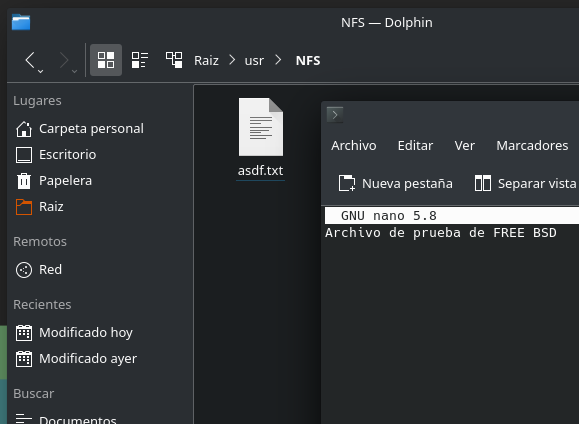
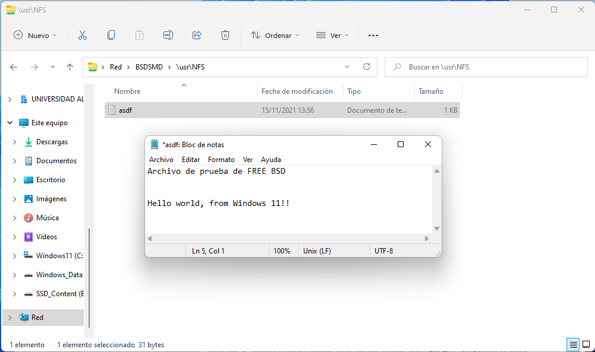
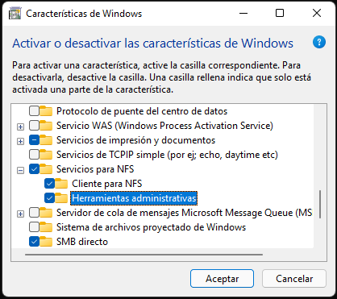
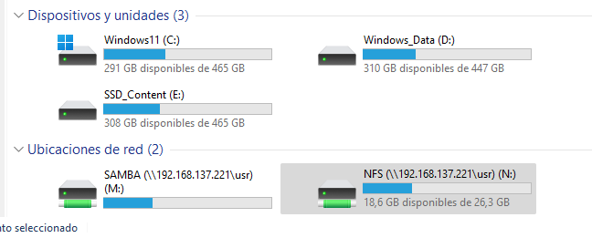

[](FreeBSD.md)

# Servicios de directorios

## NFS

Network File System es un protocolo de nivel de aplicación, según el Model OSI. Es utilizado para sistemas de archivos distribuido en un entorno de red de computadoras de área local. Este protocolo está incluido por defecto en los sistemas Unix y las distribuciones Linux. 

### Configuración de NFS

Para configurar NFS tendremos, primeramente, que escribir los siguientes comandos en la consola:

```bash
mkdir /usr/NFS
chmod 777 /usr/NFS
sysrc mountd_flags="-r"
sysrc rpcbind_enable="YES"
sysrc nfs_server_enable="YES"
sysrc portmap_enable="YES"
```

Ahora tendremos que abrir el archivo ```/etc/exports``` y añadir las líneas siguientes:

```bash
/usr/NFS -alldirs -network 192.168.137.0 mask 255.255.255.0
/usr/NFS -alldirs 192.168.137.1
/usr/src client
/usr/ports client
```

### Comandos útiles para NFS

Un detalle de unos comandos que serán útiles para NFS:

```bash 
# Reiniciar el servicio
service nfsd onestart

# Saber el estado del servicio
rpcinfo -p
```

### Un prueba de su funcionamiento

Para probar que funciona, sería interesante crear un archivo en el servidor y editarlo desde el cliente:

#### Archivo en el servidor



#### Editando el archivo en el cliente



#### :warning: NFS Client de Windows

NFS no funcionará en Windows hasta que activemos la característica en cuestión en Windows 11



Por otra parte, podemos acceder mediante los recursos de red, pero es más útil montar el servidor:

```powershell
mount.exe -o anon.nolock.casentive \\192.168.137.221\usr\NFS N:
```

## SAMBA

SAMBA es un servicio de compartición de datos entre Linux y Windows. Nos permite compartir datos y dispositivos en la red con este tipo de máquinas. Para configurar SAMBA podemos usar el script que he preparado para ello o hacerlo a mano.

### Pasos previos

La instalación y la configuración de SAMBA puede llevarse a cabo usando el [script](install_files/install_samba.sh) que he preparado para ello de la siguiente manera:

```bash
wget https://raw.githubusercontent.com/Jordilavila/dotfiles/main/FreeBSD/install_files/install_samba.sh
sh install_samba.sh
```

Por otra parte, también podemos hacerlo de manera manual. Lo primero que haremos será modificar algunos parámetros del kernel. Para ello abrimos el archivo ```/etc/sysctl.conf``` y añadimos las líneas siguientes:

```bash
kern.maxfiles=25600
kern.maxfilesperproc=16384
net.inet.tcp.sendspace=65536
net.inet.tcp.recvspace=65536
```

Ahora tendremos que habilitar las entradas y salidas asíncronas:

```bash
echo 'aio_load="YES"' >> /boot/loader.conf
```

### Instalación de SAMBA

La instalación de SAMBA se llevará a cabo usando el comando siguiente:

```bash
pkg install -y samba413-4.13.8_1
```

También tenemos que crear la carpeta de SAMBA:

```bash
mkdir /usr/SAMBA
chmod -R 777 /usr/SAMBA
```

### Archivos de configuración de SAMBA

Tras instalar SAMBA, tendremos que crear un archivo de configuración usando el siguiente comando:

```bash
touch /usr/local/etc/smb4.conf
```

Y, tras esto, le añadimos la siguiente información al archivo ```/usr/local/etc/smb4.conf```:

```bash
[SAMBA]
comment = Has accedido al SAMBA de Jordi SE.
path = \usr\SAMBA
public = no
writable = yes
printable = no
valid users = usuario
```

Ahora nos tocaría habilitar en el arranque el servicio de SAMBA y levantarlo:

```bash
sysrc samba_enable="YES"
sysrc samba_server_enable="YES"
service samba_server start
```

Y, finalmente, reiniciamos el sistema.

### :warning: Cliente Windows

Para usar un cliente Windows tendremos que tener en cuenta algunas cosas. Lo primero será montar el servidor, que para ello usaremos el siguiente comando:

```powershell
mount.exe -o anon.nolock.casesentive \\192.168.137.221\usr\SAMBA M:
```



## TrueNAS + iSCSI

TrueNAS es un sistema operativo basado en FreeBSD dedicado a montar un servidor NAS 