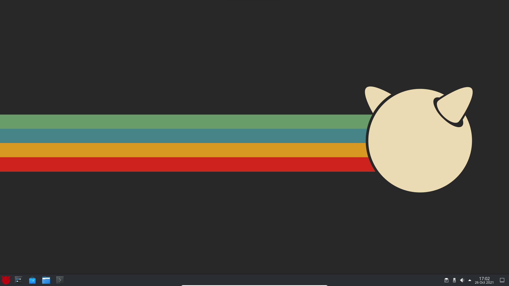

# FreeBSD

FreeBSD es un sistema unix bastante usado para montar servidores o también usado por algún purista. Yo lo he tenido que usar por alguna asignatura de la carrera y bueno, lo personalicé un poco.

## Después de la instalación

Algunas cosas importantes que hacer tras instalar FreeBSD.

### Actualización del sistema

Tras instalar un sistema operativo, lo primero que hay que hacer es actualizar el sistema operativo. Para actualizar el sistema usaremos los siguientes comandos:

```bash
# Run as root
pkg update
pkg upgrade
```

### Herramientas esenciales

Creo necesario instalar alguna paquetería de uso esencial como podría ser algún editor de texto de terminal como ```nano``` o la herramienta ```wget```. A continuación la manera de descargar estos paquetes necesarios sin los que el resto del tutorial no va a funcionar:

```bash
pkg install -y nano wget
```

### Instalación de KDE

Tras instalar FreeBSD tuve que instalar un servidor gráfico, en mi caso escogí KDE. Para instalar KDE recomiendo los siguientes pasos:

```bash
## Instalación de KDE
mount -t procfs proc /proc
pkg install -y kde5 sddm xorg firefox chromium
sysrc dbus_enable="YES" && service dbus start
sysrc sddm_enable="YES" && service sddm start
```

La instalación de KDE se puede hacer corriendo como administrador el [archivo de instalación](https://raw.githubusercontent.com/Jordilavila/dotfiles/main/FreeBSD/install_files/install_kde5.sh) que he adjuntado en el repositorio.

El archivo se puede descargar y ejecutar con los siguietnes comandos:

```bash
## Run as root
wget https://raw.githubusercontent.com/Jordilavila/dotfiles/main/FreeBSD/install_files/install_kde5.sh
sh install_kde5.sh
```

**Importante:** una vez que hemos instalado KDE5 y puesto en marcha el servicio, tendremos que cambiar de _Wayland_ a _X11_ en la pantalla de inicio de sesión.

### Si estamos en VirtualBox

Si estamos en VirtualBox vamos a querer instalar las GuestAdditions. Esto se hace de manera sencilla pues tenemos [este script](https://raw.githubusercontent.com/Jordilavila/dotfiles/main/FreeBSD/install_files/install_virtualboxguestadditions.sh) o podemos escribir las líneas siguientes:

```bash
pkg install -y emulators/virtualbox-ose-additions
sysrc vboxguest_enable="YES"
sysrc vboxservice_enable="YES"
```

El archivo se podría descargar y ejecutar con los siguientes comandos:

```bash
## Run as root
wget https://raw.githubusercontent.com/Jordilavila/dotfiles/main/FreeBSD/install_files/install_virtualboxguestadditions.sh
sh install_virtualboxguestadditions.sh
```

Esto podría lanzar un mensaje de aviso donde dice que para que las guestadditions funcionen bien, tendríamos que añadir a los usuarios que usen X11 en el grupo wheel. Para ello ejecutaremos la siguiente orden:

```bash
pw groupmod wheel -m YOUR_USERNAME
```

Ahora nos tocaría hacer un reboot del sistema.

### Una capa de personalización

Esto es opcional, sólo que me parecía un poco feo dejar FreeBSD así, con un KDE desnudo. Por lo tanto recopilé unas fotos de Internet y lo monté en un ZIP para que quien se las quiera poner se las ponga. Podéis desgar el famoso ZIP desde [aquí](https://github.com/Jordilavila/dotfiles/raw/main/FreeBSD/theme/FreeBSD_Theme.zip), o usando wget como podemos ver a continuación:

```bash
wget https://github.com/Jordilavila/dotfiles/raw/main/FreeBSD/theme/FreeBSD_Theme.zip
unzip FreeBSD_Theme.zip
```

Tras esto, nos quedaría escoger el tema _brisa oscuro_ y cambiar el fondo de escritorio al que nos encontramos en el zip (para tema oscuro, el fondo oscuro). Y, finalmente, cambiamos el icono de la barra de tareas por el de FreeBSD; esto se puede hacer haciendo click derecho sobre el icono actual y seleccionando _configurar el lanzador de aplicaciones_. 

Finalmente, nos queda algo así:



## Puesta a punto de las redes

Para poner en funcionamiento las interfaces de red en FreeBSD tendremos que acceder al archivo de configuración ```/etc/rc.conf``` para modificarlo.

Una vez accedemos a él, nos vamos a encontrar algo parecido a lo que vemos a continuación. Cabe destacar que yo estoy corriendo el sistema en Virtualbox con dos interfaces de red y se me pide que establezca la interfaz _host-only_ como estática:

```bash
hostname="freebsd_server"
keymap="es.kbd"
ifconfig_em0="DHCP"
sshd_enable="YES"
# Set dumpdev to "AUTO" to enable crash dumps, "NO" to disable
dumpdev="AUTO"
zfs_enable="YES"
dbus_enable="YES"
sddm_enable="YES"
vboxguest_enable="YES"
vboxservice_enable="YES"
```

Una vez visto el archivo, procedemos a configurar la segunda interfaz de red como DHCP, para que asigne IP automaticamente. Esto será tan sencillo como añadir la línea ```ifconfig_em1="DHCP"``` al final del archivo, mismo. Esto puede servir, pero como ya he dicho, yo necesito que esta IP sea estática. Además de esto, he modificado un poco el archivo para que sea más claro:

```bash
# FreeBSD 
hostname="freebsd_server"
keymap="es.kbd"

# Networks:
ifconfig_em0="DHCP"
ifconfig_em1="inet 192.168.56.221 netmask 255.255.255.0"

# SSH: 
sshd_enable="YES"

# Set dumpdev to "AUTO" to enable crash dumps, "NO" to disable
dumpdev="AUTO"
zfs_enable="YES"

# KDE5:
dbus_enable="YES"
sddm_enable="YES"

# VirtualBox:
vboxguest_enable="YES"
vboxservice_enable="YES"
```

Finalmente, reiniciamos.

## Servicios remotos

Lo más normal es que usemos nuestro servidor de manera remota, por lo que usaremos algunos servicios remotos como ```SSH```, ```SFTP``` y ```SCP```.

Para instalar estos servicios tendremos que instalar ```SSH```, aunque ya nos lo encontramos instalado en nuestro sistema.

### Configuración de SSH

Es necesario que por seguridad configuremos algunos aspectos de SSH para que se prohiban los accesos al usuario root y las contraseñas vacías. Para ello, tendremos que abrir el archivo ```/etc/ssh/sshd_config``` y descomentar las líneas siguientes:

```bash 
PermitRootLogin no
PermitEmptyPasswords no
```

Y, para terminar, se reinicia el servicio: 

```bash
service sshd restart
```

### Activando el log de SSH

Para activar el log de SSH tendremos que acceder al archivo ```/etc/ssh/sshd_config``` y modificar las líneas siguientes para que queden tal que así:

```bash
#Logging
SyslogFacility DAEMON
LogLevel DEBUG
```

Ahora sería interesante reiniciar el sistema o el servicio. Aunque siempre es más interesante reinciar el servicio:

```bash 
service sshd restart
```

### Generando una contraseña en un cliente para acceder al servidor

Para general las claves públicas y privadas debemos hacer lo siguiente:

```bash 
# Escalar superusuario:
su -

# Generar claves pública y privada en el directorio /home/root/.ssd
ssh-keygen -t rsa

# Acceder al directorio donde están las claves:
cd /root/.ssh

# Enviar al ordenador destino las claves para que se conecte sin pedirle la contraseña.
ssh-copy-id -i id_rsa.pub SERVER_USERNAME@SERVER_IP
```

### Funcionamiento de SFTP

Este servicio viene con SSH, por lo que no hay que instalar nada. Sólo tenemos que saber como usarlo.

Para conectarnos por Secure File Transfer Protocol usaremos el siguiente comando:

```bash
sftp REMOTE_USER@REMOTE_IP
```

### Funcionamiento de SCP

Este servicio también viene con SSH, por lo tanto, no tendremos que instalar nada.

Para conectarnos por SCP usaremos el siguiente comando:

```bash
scp <-P <puerto>> <ruta de archivo local> REMOTE_USER@REMOTE_IP:<ruta destino>
```

## Servicio de escritorio remoto con VNC

## Servicio de escritorio remoto con RDP

## Servidor de archivos NFS


## Servidor de archivos SAMBA

SAMBA es un servicio de compartición de datos entre Linux y Windows. Nos permite compartir datos y dispositivos en la red con este tipo de máquinas. Para configurar SAMBA podemos usar el script que he preparado para ello o hacerlo a mano.

### Pasos previos

La instalación y la configuración de SAMBA puede llevarse a cabo usando el [script](install_files/install_samba.sh) que he preparado para ello de la siguiente manera:

```bash
wget https://raw.githubusercontent.com/Jordilavila/dotfiles/main/FreeBSD/install_files/install_samba.sh
sh install_samba.sh
```

Por otra parte, también podemos hacerlo de manera manual. Lo primero que haremos será modificar algunos parámetros del kernel:

```bash
echo "kern.maxfiles=25600
kern.maxfilesperproc=16384
net.inet.tcp.sendspace=65536
net.inet.tcp.recvspace=65536" >> /etc/sysctl.conf
```

Ahora tendremos que habilitar las entradas y salidas asíncronas:

```bash
echo 'aio_load="YES"' >> /boot/loader.conf
```

### Instalación de SAMBA

La instalación de SAMBA se llevará a cabo usando el comando siguiente:

```bash
pkg install -y samba413-4.13.8_1
```

### Archivos de configuración de SAMBA

Tras instalar SAMBA, tendremos que crear un archivo de configuración usando el siguiente comando:

```bash
touch /usr/local/etc/smb4.conf
```

Y, tras esto, le añadimos la siguiente información mediante el comando ```echo```:

```bash
echo "[global]
    workgroup = MYGROUP
    realm = mygroup.local
    netbios name = NAS

[usuario data]
    path = /home/usuario
    public = no
    writable = yes
    printable = no
    guest ok = no
    valid users = usuario" >> /usr/local/etc/smb4.conf
```

Ahora nos tocaría habilitar en el arranque el servicio de SAMBA y levantarlo:

```bash
sysrc samba_server_enable="YES"
service samba_server start
```

Y, finalmente, reiniciamos el sistema.

## Servicio de impresión con CUPS

Tal vez necesitamos instalar un servidor de impresoras en nuestro sistema Linux para facilitar esta tarea en la red que estemos configurando. Esto lo podemos lograr usando CUPS.
Para probar el sistema, vamos a instalar una impresora PDF.

### Instalación de CUPS

Para instalar CUPS tendremos que escalar privilegios de administrador en la consola e instalar el siguiente paquete:

```bash
pkg install cups print/gutenprint print/hplip cups-pdf
```

Los ficheros de configuración de CUPS se encontrarán en ```/usr/local/etc/cups```.

### Configuración de CUPS

Tras la instalación tendremos que editar unos ficheros para configurar nuestro servidor. Primero editaremos el fichero ```/etc/defaults/devfs.rules``` y añadiremos las líneas siguientes:

```bash
[system=10]
add path 'unlpt*' mode 0660 group cups
add path 'ulpt*' mode 0660 group cups
add path 'lpt*' mode 0660 group cups
```

Tras esto, tendremos que habilitar los servicios en el arranque del sistema:

```bash
sysrc cupsd_enable="YES"
sysrc devfs_system_ruleset="system"
```

Y, finalmente, iniciarlos:

```bash
service devfs restart
service cupsd restart
```

Si queremos instalar todo esto de golpe, podemos usar un script que he preparado de la siguiente manera:

```bash
wget https://raw.githubusercontent.com/Jordilavila/dotfiles/main/FreeBSD/install_files/install_cups.sh
sh install_cups.sh
```

Ahora tendremos que abrir el archivo ```/usr/local/etc/cups/cupsd.conf``` y cambiar los bloques siguientes para habilitar la red local:

Primero vamos a deshabilitar la exclusividad del uso local:

```bash
### Bloque original:
# Only listen for connections from the local machine.
Listen localhost:631
Listen /var/run/cups/cups.sock

### Bloque a escribir:
# Listen for connections on Port 631.
Port 631
#Listen localhost:631
Listen /var/run/cups/cups.sock
```

Ahora vamos a compartir las impresoras en la red local:

```bash
### Bloque original:
# Show shared printers on the local network.
Browsing On
BrowseLocalProtocols dnssd

# Default authentication type, when authentication is required...
DefaultAuthType Basic

### Bloque a establecer:
# Show shared printers on the local network.
Browsing On
BrowseOrder allow,deny
BrowseLocalProtocols dnssd
#BrowseAllow @LOCAL
BrowseAllow 192.168.137.* # change to local LAN settings
BrowseAddress 192.168.137.* # change to local LAN settings

# Default authentication type, when authentication is required...
DefaultAuthType Basic
```

Finalmente, configuramos el servicio para que se pueda acceder a él en toda la red local:

```bash
### Bloque original:
# Restrict access to the server...
<Location />
  Order allow,deny
</Location>

# Restrict access to the admin pages...
<Location /admin>
  Order allow,deny
</Location>

# Restrict access to configuration files...
<Location /admin/conf>
  AuthType Default
  Require user @SYSTEM
  Order allow,deny
</Location>

### Bloque a escribir:
# Allow access to the server from any machine on the LAN
<Location />
  Order allow,deny
  Allow 192.168.137.* # change to local LAN settings
</Location>

# Allow access to the admin pages from any machine on the LAN
<Location /admin>
  #Encryption Required
  Order allow,deny
  Allow 192.168.137.* # change to local LAN settings
</Location>

# Allow access to configuration files from any machine on the LAN
<Location /admin/conf>
  AuthType Basic
  Require user @SYSTEM
  Order allow,deny
  Allow 192.168.137.* # change to local LAN settings
</Location>
```

Si también queremos que los clientes Windows puedan imprimir con nuestras impresoras, tendremos que acceder a los archivos ```/usr/local/share/cups/mime/mime.types``` y ```/usr/local/share/cups/mime/mime.convs``` y descomentar la línea siguiente:

```bash
application/octet-stream
```

### Activando el log de CUPS

En el caso de querer activar el log de CUPS tendremos que acceder al archivo ```/usr/local/etc/cups/cupsd.conf``` y cambiar la línea siguiente:

```bash
### Línea original:
LogLevel warn

### Línea a establecer:
LogLevel debug
```

### Configurando la impresora PDF

Para configurar la impresora PDF será tan sencillo como acceder a nuestra máquina virtual desde el navegador empleando la dirección IP y puerto ```192.168.137.221:631```. 

Nos iremos a la pestaña de administración y nos logueamos con el usuario ```root```. Tras esto, añadiremos una impresora:


Le damos a continuar y configuramos el nombre de la impresora, la descripción etc.Importante marcar que queremos compartir la impresora.


Tras esto tendremos que configurar algun aspecto más de la impresora. Tenemos que establecer como fabricante genérico y como modelo el de _Generic color postscript printer (en)_.

Finalmente, ya tenemos la impresora configurada.

## Servidor de bases de datos - PostgreSQL

TODO

## Servidor Apache

Es interesante poder lanzar páginas web desde nuestro servidor, por lo que vamos a instalar Apache y lanzar dos webs. Una web nos mostrará la tabla de MariaDB que hemos creado en el punto anterior y otra web montará un CMS.

Para llevar a cabo todo esto, vamos a instalar Apache, PhpMyAdmin y todo el paquete PHP y, como CMS, Wordpress.

### Instalando Apache

Para poder llevar a cabo la implantación del servidor web, tendremos que habilitarlo. Para ello vamos a usar la siguiente batería de comandos:

```bash
# Instalación de la paquetería necesaria:
pkg install -y apache24 openssl

# Habilitando y arrancando el servidor:
service apache24 enable
service apache24 start

# Aviso: Puede que salten warnings, que no cunda el pánico
```

### Activando el modo debug en Apache

Para activar los logs de apache, tendremos que dirigirnos al archivo ```/usr/local/etc/apache24/httpd.conf``` y cambiar la línea siguiente:

```bash
# Línea original:
LogLevel warn

# Línea final:
LogLevel debug
```

### Configurando los VirtualHosts

Los _VirtualHosts_ son dominios ficticios alojados en un mismo servidor. Es decir, para una misma IP tendremos más de una página web. Lo primero que vamos a hacer con los hosts virtuales será crear las carpetas con las que vamos a trabajar, para ello usaremos el siguiente bloque de comandos:

```bash 
## Creando las carpetas
mkdir -p /usr/local/docs/databasereader.host/public_html
mkdir -p /usr/local/docs/chorizosalexa.es/public_html
mkdir -p /var/log/databasereader.host/
mkdir -p /var/log/chorizosalexa.es/

## Cambiando los permisos de las carpetas
chmod -R 755 /usr/local/docs
```

Ahora tocaría acceder de nuevo al archivo de configuración de Apache para habilitar la inclusión del archivo externo donde especificaremos los VirtualHosts:

```bash
# Acceso al archivo:
nano /usr/local/etc/apache24/httpd.conf

### Bloque original:
# Virtual hosts
#Include etc/apache24/extra/httpd-vhosts.conf

# Virtual hosts
Include etc/apache24/extra/httpd-vhosts.conf
```

Ahora tendríamos que guardarnos una copia del archivo de los virtual hosts y luego abrir el archivo:

```bash
# Guardando una copia:
cp /usr/local/etc/apache24/extra/httpd-vhosts.conf /usr/local/etc/apache24/extra/httpd-vhosts.conf.backup

# Abriendo el archivo original:
nano /usr/local/etc/apache24/extra/httpd-vhosts.conf
```

Una vez hemos abierto el archivo original, yo le he añadido estos VirtualHosts:

```bash
# DatabaseReader VirtualHost
<VirtualHost *:80>
  ServerName www.databasereader.host
  ServerAlias databasereader.host
  DocumentRoot /usr/local/docs/databasereader.host/public_html
  ErrorLog /var/log/databasereader.host/error.log
  CustomLog /var/log/databasereader.host/request.log common
</VirtualHost>

# Chorizos Alexa VirtualHost
<VirtualHost *:80>
  ServerName www.chorizosalexa.es
  ServerAlias chorizosalexa.es
  DocumentRoot /usr/local/docs/chorizosalexa.es/public_html
  ErrorLog /var/log/chorizosalexa.es/error.log
  CustomLog /var/log/chorizosalexa.es/request.log common
</VirtualHost>
```

https://comoinstalar.me/como-instalar-apache-en-freebsd-12/
