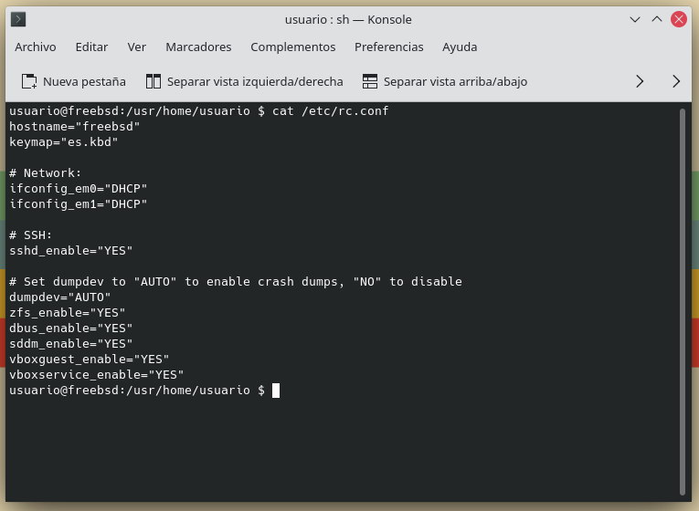

[](FreeBSD.md)

# Servicios de Red

## DHCP

_DHCP_ es un protocolo de configuración dinámica de Host. Se trata un protocolo de red cliente/servidor con el que se asigna dinámicamente una dirección IP y otros parámetros de configuración de red a cada dispositivo en una red para que puedan comunicarse con otras redes IP. El servidor guarda una tabla de IPs asociadas a las MAC de algunas máquinas para asignar la dirección a éstas de manera prácticamente instantánea cuando se vuelvan a conectar a la red.

### Instalación de DHCP

La instalación del servidor DHCP en FreeBSD se puede realizar con un script que he preparado o con los comandos de instalación.

#### Opción 1: Instalación desde script

Para instalar DHCP con el script que he preparado tendremos que hacer lo siguiente:

```bash
wget https://raw.githubusercontent.com/Jordilavila/dotfiles/main/FreeBSD/install_files/install_dhcp.sh
sh install_dhcp.sh
```

#### Opción 2: Instalación desde comandos

Para instalar DHCP con los comandos de instalación realizaremos lo siguiente:

```bash
# Actualización del sistema
pkg update -y && pkg upgrade -y

# Instalación del servidor DHCP
pkg install -y dhcpd

# Habilitando el servicio
sysrc dhcpd_enable="YES"
sysrc dhcpd_ifaces="em1"

# Reiniciando el servicio
service dhcpd restart
```

### Configuración del servidor DHCP

Para configurar el servidor DHCP entraremos al archivo ```/usr/local/etc/dhcpd.conf``` y lo dejaremos tal que así (en mi caso):

```bash
# dhcpd.conf
#
# Sample configuration file for ISC dhcpd
#

# option definitions common to all supported networks...
option domain-name "freebsd_server.jordi.es";

default-lease-time 600;
max-lease-time 7200;
authoritative;

subnet 192.168.137.0 netmask 255.255.255.0 {
        range dynamic-bootp 192.168.137.101 192.168.137.150;
        option broadcast-address 192.168.137.255;
        option routers 192.168.137.1;
}
```

Ahora tendríamos que reiniciar el servicio con el comando ```service dhcpd restart``` y arrancar una segunda máquina a modo de cliente y verificar que se conecte con el servidor DHCP.

La interfaz de red del cliente debería de quedarse similar a esta:



Y, finalmente, la prueba del algodón:


## DNS

## GIT

GIT es un software de control de versiones diseñado por Linus Torvalds, pensando en la eficiencia, la confiabilidad y compatibilidad del mantenimineto de versiones de aplicaciones cuando estas tienen un gran número de archivos de código fuente.

### Instalación y configuración de GIT

Para llevar a cabo la instalación de un servidor GIT en FreeBSD seguiremos los pasos siguientes:

```bash
# Actualizar el sistema:
pkg update && pkg upgrade -y

# Instalar GIT
pkg install -y git

# Creamos el usuario git:
pw user add git -m -s /usr/local/bin/bash

# Estableciendo una contraseña para el usuario git:
passwd git
```

También tenemos que crear las carpetas que vamos a utilizar:

```bash
mkdir -p /home/git/.ssh
ssh-keygen -t rsa
cat ~/.ssh/id_rsa.pub > /home/git/.ssh/authorized_keys
chown -R git:git /home/git/.ssh
chmod 0700 /home/git/.ssh
chmod 0600 /home/git/.ssh/authorized_keys
```

Finalmente tocaría habilitar los servicios:

```bash 
# Habilitamos el servicio
sysrc git_daemon_enable="YES" && service git_daemon start
```

Para terminar, entramos en el usuario git y creamos los directorios requeridos y montamos el servidor:

```bash
su git
cd /home/git
mkdir -p Projects
cd Projects
git init --bare --shared
```

Tras esto nuestro servidor Git en FreeBSD estará funcionando y nos podremos guardar nuestras cosas en él.

### Comandos de git

Por recordar algunos comandos de Git:

```bash
# Iniciar un repositorio en el directorio actual
git init 

# Conectarse a un repositorio remoto
git remote add origin git@SERVER_NAME_OR_IP:/home/git/Projects

# Sincronizarse con el repositorio remoto
git fetch origin

# Comprobar el estado del repositorio local
git status

# Descargar archivos remotos
git pull origin

# Subir archivos locales 
git push

# Añadir archivos al stash 
git add ARCHIVO

# Hacer un commit
git commit -m "MENSAJE DEL COMMIT"
```

## NextCloud

Estamos acostumbrados a utilizar los servicios en la nube de Dropbox, OneDrive, Google, Amazon, etc. Pero, ¿y si nos creamos nuestra propia nube privada? Pues es posible, tan solo necesitamos _NextCloud_.

_NextCloud_ es una aplicación de software libre que permite el almacenamiento en línea y aplicaciones en línea. Lo podemos instalar un servidor que disponga de una versión reciente de PHP y con soporte de SQLite, MySQL/MariaDB o PostgreSQL, lo que cumple con los requisitos para instalarlo en nuestro servidor FreeBSD.

Los requisitos para llevar a cabo la instalación de _NextCloud_ en nuestro caso, son los siguientes:

- MariaDB o MySQL
- Apache
- Un VirtualHost en Apache para _NextCloud_
- PHP

### Creando la base de datos

Lo primero será crear la base de datos con MariaDB. Para ello nos loguearemos con ```mysql -u root -p``` usaremos los siguientes comandos:

```sql
CREATE USER 'nextclouduser'@localhost IDENTIFIED BY 'nextclouduser';
CREATE DATABASE nextcloud CHARACTER SET utf8mb4 COLLATE utf8mb4_general_ci;
GRANT ALL ON nextcloud.* TO 'nextclouduser'@'localhost' IDENTIFIED BY 'nextclouduser';
EXIT;
```

### Descargando NextCloud

Para descargar NextCloud vamos a realizar lo siguiente:

```bash
wget https://download.nextcloud.com/server/releases/nextcloud-22.2.2.zip -O nextcloud.zip
unzip nextcloud.zip -d /usr/local/docs/minube.com/
```

Tras esto tendríamos que seguir una configuración bastante similar a la de WordPress y ya tendríamos el servicio activo. Aunque puede que necesitemos darle permisos antes de llevar a cabo la instalación:

```bash
chmod -R 777 /usr/local/docs/minube.com
chown -R www:www /usr/local/docs/minube.com
```


