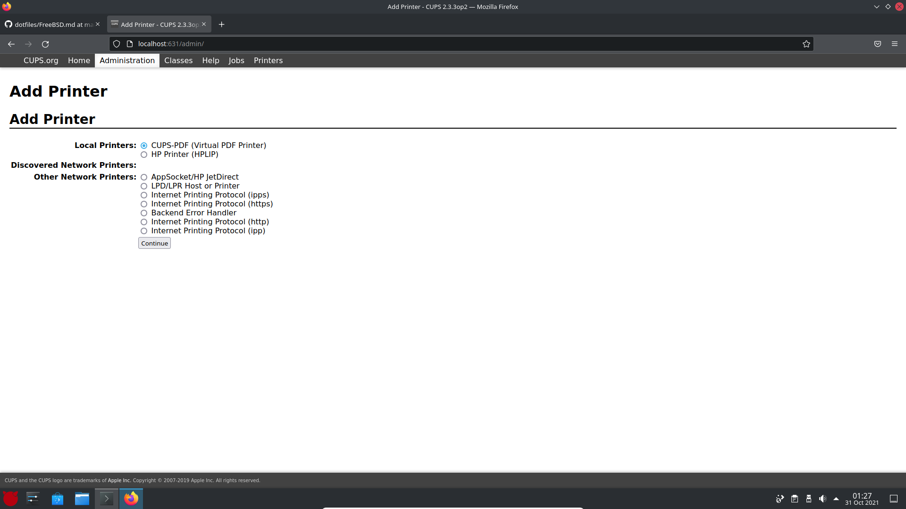
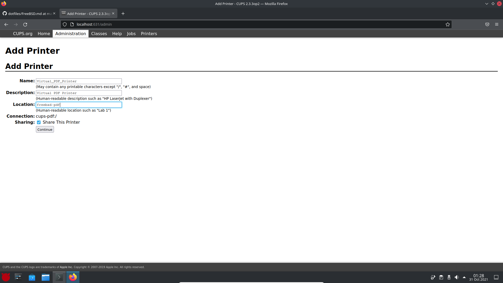

[](FreeBSD.md)

# Servicio de impresión con CUPS

Tal vez necesitamos instalar un servidor de impresoras en nuestro sistema Linux para facilitar esta tarea en la red que estemos configurando. Esto lo podemos lograr usando CUPS.
Para probar el sistema, vamos a instalar una impresora PDF.

## Instalación de CUPS

Para instalar CUPS tendremos que escalar privilegios de administrador en la consola e instalar el siguiente paquete:

```bash
pkg install cups print/gutenprint print/hplip cups-pdf cups-filters
```

Los ficheros de configuración de CUPS se encontrarán en ```/usr/local/etc/cups```.

## Configuración de CUPS

Tras la instalación tendremos que editar unos ficheros para configurar nuestro servidor. Primero editaremos el fichero ```/etc/defaults/devfs.rules``` y añadiremos las líneas siguientes:

```bash
[system=10]
add path 'unlpt*' mode 0660 group cups
add path 'ulpt*' mode 0660 group cups
add path 'lpt*' mode 0660 group cups
```

Tras esto, tendremos que habilitar los servicios en el arranque del sistema:

```bash
sysrc cupsd_enable="YES"
sysrc devfs_system_ruleset="YES"
```

Y, finalmente, iniciarlos:

```bash
service devfs restart
service cupsd restart
cupsctl --remote-admin
```

Ahora creamos la carpeta donde vamos a guardar los PDFs, que en mi caso será en un directorio compartido mediante SAMBA:

```bash
mkdir /usr/SAMBA/PDFs
chmod -R 777 /usr/SAMBA
```

Si queremos instalar todo esto de golpe, podemos usar un script que he preparado de la siguiente manera:

```bash
wget https://raw.githubusercontent.com/Jordilavila/dotfiles/main/FreeBSD/install_files/install_cups.sh
sh install_cups.sh
```

Ahora tendremos que abrir el archivo ```/usr/local/etc/cups/cupsd.conf``` y cambiar los bloques siguientes para habilitar la red local:

Primero vamos a deshabilitar la exclusividad del uso local:

```bash
### Bloque original:
# Only listen for connections from the local machine.
Listen localhost:631
Listen /var/run/cups/cups.sock

### Bloque a escribir:
# Listen for connections on Port 631.
Port 631
#Listen localhost:631
Listen /var/run/cups/cups.sock
```

Ahora vamos a cambiar el directorio donde se imprimen los PDFs. En mi caso, los voy a dejar en una carpeta compartida en red mediante SAMBA:

```bash
### Línea original:
Out /var/spool/cups-pdf/${USER}

### Bloque a escribir
#Out /var/spool/cups-pdf/${USER}
Out /usr/SAMBA/PDFs
```

```bash
### Línea original:
AnonDirName /var/spool/cups-pdf/ANONYMOUS

### Bloque a escribir:
#AnonDirName /var/spool/cups-pdf/ANONYMOUS
AnonDirName /usr/SAMBA/PDFs
```

Ahora vamos a compartir las impresoras en la red local:

```bash
### Bloque original:
# Show shared printers on the local network.
Browsing On
BrowseLocalProtocols dnssd

# Default authentication type, when authentication is required...
DefaultAuthType Basic

### Bloque a establecer:
# Show shared printers on the local network.
Browsing On
BrowseOrder allow,deny
BrowseLocalProtocols dnssd
#BrowseAllow @LOCAL
BrowseAllow 192.168.137.* # change to local LAN settings
BrowseAddress 192.168.137.* # change to local LAN settings

# Default authentication type, when authentication is required...
DefaultAuthType Basic
```

Finalmente, configuramos el servicio para que se pueda acceder a él en toda la red local:

```bash
### Bloque original:
# Restrict access to the server...
<Location />
  Order allow,deny
</Location>

# Restrict access to the admin pages...
<Location /admin>
  Order allow,deny
</Location>

# Restrict access to configuration files...
<Location /admin/conf>
  AuthType Default
  Require user @SYSTEM
  Order allow,deny
</Location>

### Bloque a escribir:
# Allow access to the server from any machine on the LAN
<Location />
  Order allow,deny
  Allow 192.168.137.* # change to local LAN settings
</Location>

# Allow access to the admin pages from any machine on the LAN
<Location /admin>
  #Encryption Required
  Order allow,deny
  Allow 192.168.137.* # change to local LAN settings
</Location>

# Allow access to configuration files from any machine on the LAN
<Location /admin/conf>
  AuthType Basic
  Require user @SYSTEM
  Order allow,deny
  Allow 192.168.137.* # change to local LAN settings
</Location>
```

Si también queremos que los clientes Windows puedan imprimir con nuestras impresoras, tendremos que acceder a los archivos ```/usr/local/share/cups/mime/mime.types``` y ```/usr/local/share/cups/mime/mime.convs``` y descomentar la línea siguiente:

```bash
application/octet-stream
```

## Activando el log de CUPS

En el caso de querer activar el log de CUPS tendremos que acceder al archivo ```/usr/local/etc/cups/cupsd.conf``` y cambiar la línea siguiente:

```bash
### Línea original:
LogLevel warn

### Línea a establecer:
LogLevel debug
```

## Configurando la impresora PDF

Para configurar la impresora PDF será tan sencillo como acceder a nuestra máquina virtual desde el navegador empleando la dirección IP y puerto ```192.168.137.221:631```. 

Nos iremos a la pestaña de administración y nos logueamos con el usuario ```root```. Tras esto, añadiremos una impresora:



Le damos a continuar y configuramos el nombre de la impresora, la descripción etc. Importante marcar que queremos compartir la impresora.



Tras esto tendremos que configurar algun aspecto más de la impresora. Tenemos que establecer como fabricante genérico y como modelo el de _Generic color postscript printer (en)_.

Finalmente, ya tenemos la impresora configurada.
