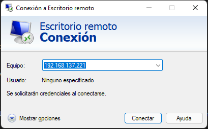
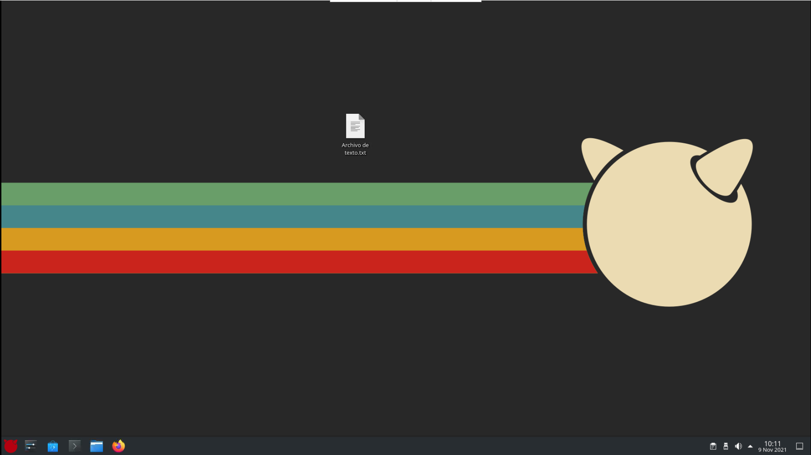

[](FreeBSD.md)


# Servicios remotos

## SSH, SCP y SFTP

Lo más normal es que usemos nuestro servidor de manera remota, por lo que usaremos algunos servicios remotos como ```SSH```, ```SFTP``` y ```SCP```.

Para instalar estos servicios tendremos que instalar ```SSH```, aunque ya nos lo encontramos instalado en nuestro sistema.

### Configuración de SSH

Es necesario que por seguridad configuremos algunos aspectos de SSH para que se prohiban los accesos al usuario root y las contraseñas vacías. Para ello, tendremos que abrir el archivo ```/etc/ssh/sshd_config``` y descomentar las líneas siguientes:

```bash 
PermitRootLogin no
PermitEmptyPasswords no
```

Y, para terminar, se reinicia el servicio: 

```bash
service sshd restart
```

### Activando el log de SSH

Para activar el log de SSH tendremos que acceder al archivo ```/etc/ssh/sshd_config``` y modificar las líneas siguientes para que queden tal que así:

```bash
#Logging
SyslogFacility DAEMON
LogLevel DEBUG
```

Ahora sería interesante reiniciar el sistema o el servicio. Aunque siempre es más interesante reinciar el servicio:

```bash 
service sshd restart
```

### Generando una contraseña en un cliente para acceder al servidor

Para general las claves públicas y privadas debemos hacer lo siguiente:

```bash
# Generar claves pública y privada en el directorio /home/root/.ssd
ssh-keygen -t rsa

# Acceder al directorio donde están las claves:
cd /root/.ssh

# Enviar al ordenador destino las claves para que se conecte sin pedirle la contraseña.
ssh-copy-id -i id_rsa.pub SERVER_USERNAME@SERVER_IP
```

### Funcionamiento de SFTP

Este servicio viene con SSH, por lo que no hay que instalar nada. Sólo tenemos que saber como usarlo.

Para conectarnos por Secure File Transfer Protocol usaremos el siguiente comando:

```bash
sftp REMOTE_USER@REMOTE_IP
```

### Funcionamiento de SCP

Este servicio también viene con SSH, por lo tanto, no tendremos que instalar nada.

Para conectarnos por SCP usaremos el siguiente comando:

```bash
scp <-P <puerto>> <ruta de archivo local> REMOTE_USER@REMOTE_IP:<ruta destino>
```

## VNC

VNC es un programa de software libre basado en una estructura cliente-servidor que permite observar las acciones del ordenador servidor remotamente a través de un ordenador cliente. VNC no impone restricciones en el sistema operativo del ordenador servidor con respecto al del cliente: es posible compartir la pantalla de una máquina con cualquier sistema operativo que admita VNC conectándose desde otro ordenador o dispositivo que disponga de un cliente VNC portado.

Esto nos puede ser insteresante de instalar por el mismo motivo que hemos instalado SSH, para acceder remotamente a nuestro servidor. Pero, en este caso, para tener acceso al escritorio.

### Servidor

VNC en el lado de la máquina servidor.

#### Instalación del servidor VNC

Lo primero que tendremos que hacer será actualizar el sistema e instalar VNC:

```bash
pkg update && pkg upgrade -y
pkg install -y x11vnc
```

#### Configurando y lanzando el servidor

Lo primero que vamos a configurar en el servidor es una contraseña, para ello usaremos el siguiente comando (nunca desde el usuario root):

```bash
x11vnc -storepasswd
```

Luego, para lanzarlo, podemos usar un script de bash que he escrito para ello, pero tendríamos que revisarlo para que funcione bien acorde a nuestro usuario:

```bash
# Descargando el script
wget https://github.com/Jordilavila/dotfiles/raw/main/FreeBSD/install_files/vnc_server_launch.sh

# Arrancando el servidor con el script:
bash vnc_server_launch.sh
```

El otro modo de lanzarlo sería este:

```bash
x11vnc -shared -rfbauth /home/usuario/.vnc/passwd -noxdamage -geometry 1024x768
```

### Cliente

VNC en el lado de la máquina cliente.

#### Instalación del cliente VNC

Para instalar el cliente VNC introduciremos los siguientes comandos en el sistema FreeBSD Cliente:

```bash
pkg update && pkg upgrade -y
pkg install -y tigervnc-viewer
```

#### Lanzando el cliente VNC para conectarnos al servidor

Para lanzar el cliente VNC usaremos este comando:

```bash
vncviewer usuario@192.168.137.221:5900
```

Se nos pedirá la contraseña que hemos establecido en la máquina remota y podremos acceder a ella para tener el control absoluto sobre la misma. 

## RDP

_Remote Desktop Protocol_

<div style="text-align:center">
    
</div>

RDP es un servicio de escritorio remoto.

Podemos instalar y configurar RDP mediante el uso de este script:

```bash
wget https://raw.githubusercontent.com/Jordilavila/dotfiles/main/FreeBSD/install_files/install_rdp.sh
sh install_rdp.sh
```

Por otra parte, podemos instalar y configurar RDP mediante comandos. Para instalarlo introduciremos el siguiente comando:

```bash
pkg install -y xrdp
```

Y ahora vendría la configuración:

```bash
sysrc xrdp_enable="YES"
sysrc xrdp_sesman_enable="YES"
service xrdp restart
```

En mi caso estoy trabajando con un entorno gráfico KDE Plasma bajo X11. Esto significa que tengo que modificar un archivo de RDP. Realmente, este archivo es necesario modificarlo según el sistema que tengamos instalado en nuestra máquina. En la mayoría de los casos, la modificación será descomentar una línea, pero, en el caso que me ocupa no será así, tendré que añadir el escritorio KDE que estamos usando y que no es el que hay en el archivo ```/usr/local/etc/xrdp/startwm.sh``` para que quede tal que así:

```bash
#!/bin/sh
#
# This script is an example. Edit this to suit your needs.
# If ${HOME}/startwm.sh exists, xrdp-sesman will execute it instead of this.

#### set environment variables here if you want
export LANG=en_US.UTF-8

#### start desktop envirnment
# exec gnome-session
# exec mate-session
# exec start-lumnina-desktop
# exec startkde
# exec startxfce4
exec startplasma-x11
# exec xterm
```

Tras esto, es recomendable reiniciar el sistema.

Finalmente, nos conectamos mediante la aplicación de escritorio remoto de Windows:


