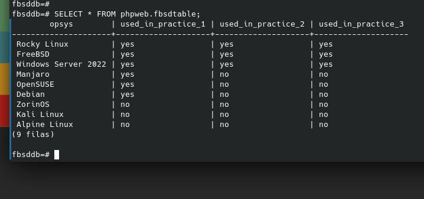
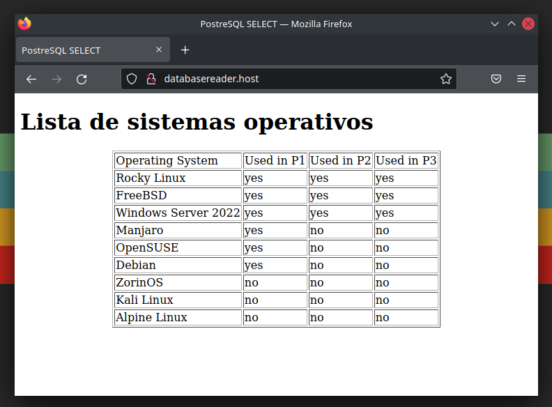
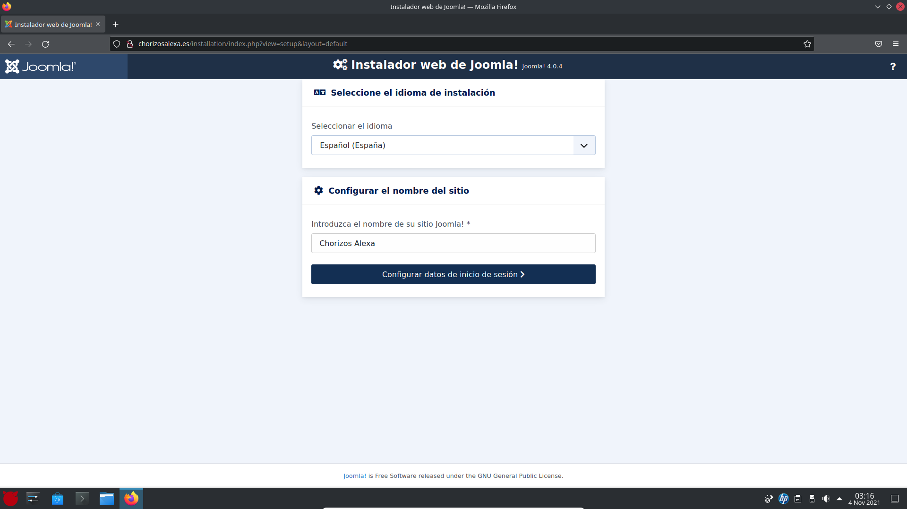

[](FreeBSD.md)


# Servicios de Web y Base de datos

## Servidor PostgreSQL

PostgreSQL es un sistema de gestión de bases de datos relacional orientado a objetos y de codigo abierto. Tiene un lenguaje propio llamado _PL/PgSQL_ muy similar al _PL/SQL_ de Oracle.

### Instalando PostgreSQL

Para instalar PostgreSQL usaremos el siguiente comando:

```bash
# Actualizar el sistema.
pkg update && pkg upgrade -y

# Instalar PostgreSQL
pkg install -y postgresql12-server
```

Cabe destacar que el usuario y grupo donde se ejecuta PostgreSQL es _postgres_. Ahora, habilitemos el servicio e iniciémoslo:

```bash
# Habilitando el servicio en /etc/rc.conf:
service postgresql enable

# Inicialicemos la base de datos:
service postgresql initdb

# Arranquemos el servicio:
service postgresql start
```

### Configurando el servidor

Para acceder a la consola de postgres usaremos el siguiente comando:

```bash
sudo -u postgres psql
```

Para crear un usuario podemos usar el comando siguiente:

```bash
sudo -u postgres createuser --interactive -P
```

Nos pedirá nombre de usuario, yo he puesto ```phpuser``` porque es con lo que lo voy a user. No es superusuario, tampoco puede crear tablas y mucho menos crear usuarios.

### Creando una base de datos y una tabla

Para crear una tabla entraremos con el usuario root, igual que con el punto anterior usando ```sudo -u postgres psql```. Acto seguido procederemos a crear la base de datos y la tabla:

```sql
CREATE DATABASE fbsddb;

\connect fbsddb;

CREATE SCHEMA phpweb;

ALTER DEFAULT PRIVILEGES IN SCHEMA phpweb
GRANT SELECT ON TABLES TO phpuser;

CREATE TABLE phpweb.fbsdtable (
  opsys varchar(100),
  used_in_practice_1 varchar(20),
  used_in_practice_2 varchar(20),
  used_in_practice_3 varchar(20),
  primary key (opsys)
);

INSERT INTO fbsdtable values ('Rocky Linux', 'yes', 'yes', 'yes');
INSERT INTO fbsdtable values ('FreeBSD', 'yes', 'yes', 'yes');
INSERT INTO fbsdtable values ('Windows Server 2022', 'yes', 'yes', 'yes');
INSERT INTO fbsdtable values ('Manjaro', 'yes', 'no', 'no');
INSERT INTO fbsdtable values ('OpenSUSE', 'yes', 'no', 'no');
INSERT INTO fbsdtable values ('Debian', 'yes', 'no', 'no');
INSERT INTO fbsdtable values ('ZorinOS', 'no', 'no', 'no');
INSERT INTO fbsdtable values ('Kali Linux', 'no', 'no', 'no');
INSERT INTO fbsdtable values ('Alpine Linux', 'no', 'no', 'no');
```

Ahora podemos comprobar que se ha creado y rellenado la tabla con un select:

```sql
SELECT * FROM phpweb.fbsdtable;
```



### Garantizando el acceso a las tablas al usuario phpuser

Para acceder al usuario _phpuser_ tendremos que introducir el comando ```psql fbsdtable phpuser```. Si nos damos cuenta, la estructura del comando es tal que así: ```psql <database> <user>```. Una vez accedemos al usuario e intentamos hacer una select de la tabla _fbsdtable_, nos dirá que el usuario _phpuser_ no tiene permisos para acceder. 

Para garantizarle los permisos, entraremos a Postgres con el usuario de administrador (```sudo -u postgres psql```) e introduciremos lo siguiente:

```sql
GRANT USAGE ON SCHEMA phpweb TO phpuser;
GRANT ALL ON ALL TABLES IN SCHEMA phpweb TO phpuser;
GRANT ALL ON ALL SEQUENCES IN SCHEMA phpweb TO phpuser;
GRANT ALL ON ALL FUNCTIONS IN SCHEMA phpweb TO phpuser;
```

Ahora ya podemos probar la sentencia ```SELECT```, para obtener la tabla que habíamos creado anteriormente.

## Servidor Apache

Es interesante poder lanzar páginas web desde nuestro servidor, por lo que vamos a instalar Apache y lanzar dos webs. Una web nos mostrará la tabla de MariaDB que hemos creado en el punto anterior y otra web montará un CMS.

Para llevar a cabo todo esto, vamos a instalar Apache, PhpMyAdmin y todo el paquete PHP y, como CMS, Wordpress.

### Instalando Apache

Para poder llevar a cabo la implantación del servidor web, tendremos que habilitarlo. Para ello vamos a usar la siguiente batería de comandos:

```bash
# Instalación de la paquetería necesaria:
pkg install -y apache24 openssl

# Habilitando y arrancando el servidor:
service apache24 enable
service apache24 start

# Aviso: Puede que salten warnings, que no cunda el pánico
```

### Activando el modo debug en Apache

Para activar los logs de apache, tendremos que dirigirnos al archivo ```/usr/local/etc/apache24/httpd.conf``` y cambiar la línea siguiente:

```bash
# Línea original:
LogLevel warn

# Línea final:
LogLevel debug
```

### Configurando los VirtualHosts

Los _VirtualHosts_ son dominios ficticios alojados en un mismo servidor. Es decir, para una misma IP tendremos más de una página web. Lo primero que vamos a hacer con los hosts virtuales será crear las carpetas con las que vamos a trabajar, para ello usaremos el siguiente bloque de comandos:

```bash 
## Creando las carpetas
mkdir -p /usr/local/docs/databasereader.host/public_html
mkdir -p /usr/local/docs/chorizosalexa.es/public_html
mkdir -p /var/log/databasereader.host/
mkdir -p /var/log/chorizosalexa.es/

## Cambiando los permisos de las carpetas
chmod -R 755 /usr/local/docs

chown -R www:www /usr/local/docs
```

Ahora tocaría acceder de nuevo al archivo de configuración de Apache para habilitar la inclusión del archivo externo donde especificaremos los VirtualHosts:

```bash
# Acceso al archivo:
nano /usr/local/etc/apache24/httpd.conf

### Bloque original:
# Virtual hosts
#Include etc/apache24/extra/httpd-vhosts.conf

# Virtual hosts
Include etc/apache24/extra/httpd-vhosts.conf
```

Ahora tendríamos que guardarnos una copia del archivo de los virtual hosts y luego abrir el archivo:

```bash
# Guardando una copia:
cp /usr/local/etc/apache24/extra/httpd-vhosts.conf /usr/local/etc/apache24/extra/httpd-vhosts.conf.backup

# Abriendo el archivo original:
nano /usr/local/etc/apache24/extra/httpd-vhosts.conf
```

Una vez hemos abierto el archivo original, yo le he añadido estos VirtualHosts:

```bash
# Directory Access:
<Directory /usr/local/docs>
  Require all granted
</Directory>

# DatabaseReader VirtualHost
<VirtualHost *:80>
  ServerName www.databasereader.host
  ServerAlias databasereader.host
  DocumentRoot /usr/local/docs/databasereader.host/public_html
  ErrorLog /var/log/databasereader.host/error.log
  CustomLog /var/log/databasereader.host/request.log common
</VirtualHost>

# Chorizos Alexa VirtualHost
<VirtualHost *:80>
  ServerName www.chorizosalexa.es
  ServerAlias chorizosalexa.es
  DocumentRoot /usr/local/docs/chorizosalexa.es/public_html
  ErrorLog /var/log/chorizosalexa.es/error.log
  CustomLog /var/log/chorizosalexa.es/request.log common
</VirtualHost>
```

Ahora tendríamos que añadir las direcciones web al archivo ```/etc/hosts```, justo en la línea de la IP ```127.0.0.1``` para que se puedan ver en localhost.

https://comoinstalar.me/como-instalar-apache-en-freebsd-12/

### Instalando PHP

Para instalar PHP usaremos la siguiente batería de comandos:

```bash
pkg update && pkg upgrade -y
pkg install -y php74-{curl,iconv,json,mbstring,session,simplexml,xml,zip,zlib,pgsql}
pkg install mod_php74
```

Tras la instalación creamos el archivo de configuración de Apache (_php.conf_) en la ruta ```/usr/local/etc/apache24/Includes/php.conf``` y lo abrimos para rellenarlo con esto:

```bash 
<IfModule dir_module>
    DirectoryIndex index.php index.html
    <FilesMatch "\.php$">
        SetHandler application/x-httpd-php
    </FilesMatch>
    <FilesMatch "\.phps$">
        SetHandler application/x-httpd-php-source
    </FilesMatch>
</IfModule>
```

Ahora nos tocaría reiniciar Apache:

```bash
service apache24 reload
```

### Probando PHP

Una de las misiones que tenemos tras haber creado una base de datos en PostgreSQL es mostrar la tabla que hemos creado usando el navegador y esto lo podemos hacer mediante PHP. Para ello he preparado este archivo que guardaremos como index.php en el host virtual que corresponda:

```php
<!DOCTYPE html>
<html lang="es">
  <head>
    <meta charset="utf-8">
    <title>PostreSQL SELECT</title>
  </head>

  <body>
    <h1>Lista de sistemas operativos</h1>
    <table border="1" align="center">
      <tr>
        <td>Operating System</td>
        <td>Used in P1</td>
        <td>Used in P2</td>
        <td>Used in P3</td>
      </tr>
      <?php
        $db_conn = pg_connect("host=localhost dbname=fbsddb user=phpuser password=phpuser");
        $result = pg_query($db_conn,"SELECT * FROM phpweb.fbsdtable");
        while ($row=pg_fetch_assoc($result)) {
          echo
             "<tr>
                <td>{$row['opsys']}</td>
                <td>{$row['used_in_practice_1']}</td>
                <td>{$row['used_in_practice_2']}</td>
                <td>{$row['used_in_practice_3']}</td>
             </tr>\n";
        }
      ?>
    </table>
  </body>
</html>
```

Finalmente, reiniciamos el servidor web con ```service apache24 restart``` y volvemos a acceder a la web. Tendremos pintada la tabla de la base de datos que habríamos creado anteriormente. En caso de no salir la base de datos, pulsamos en el teclado ```CTRL + F5``` para que se refresque toda la página.



### Instalando Joomla

Joomla es el CMS que usaremos con FreeBSD. Para descargar e instalar Joomla en nuestro servidor usaremos la siguiente batería de comandos:

```bash 
fetch https://downloads.joomla.org/cms/joomla4/4-0-4/Joomla_4-0-4-Stable-Full_Package.zip -o joomla4.zip

mkdir /usr/local/docs/chorizosalexa.es/public_html/joomla

unzip joomla4.zip -d /usr/local/docs/chorizosalexa.es/public_html/joomla

mv /usr/local/docs/chorizosalexa.es/public_html/joomla/htaccess.txt /usr/local/docs/chorizosalexa.es/public_html/joomla/.htaccess

chown -R www:www /usr/local/docs/chorizosalexa.es/public_html/joomla
```

### Preparando Apache para Joomla

Joomla puede utilizar un módulo de Apache llamado _rewrite_ que se encuentra deshabilitado por defecto. Para activarlo tendremos que acceder al archivo de configuración ```/usr/local/etc/apache24/httpd.conf``` y descomentar la línea siguiente:

```bash
#LoadModule rewrite_module libexec/apache24/mod_rewrite.so
```

Ahora tendremos que editar el virtual host de chorizosalexa.es para que entre a la carpeta en cuestión. Quedaría tal que así:

```bash 
# Chorizos Alexa VirtualHost
<VirtualHost *:80>
  ServerName www.chorizosalexa.es
  ServerAlias chorizosalexa.es
  DocumentRoot /usr/local/docs/chorizosalexa.es/public_html/joomla
  ErrorLog /var/log/chorizosalexa.es/error.log
  CustomLog /var/log/chorizosalexa.es/request.log common
</VirtualHost>
```

Tras esto, reiniciamos apache con el comando ```service apache24 restart``` y entramos a la web:


