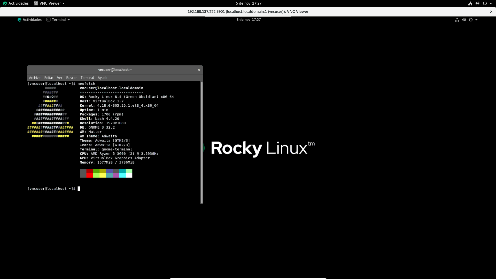
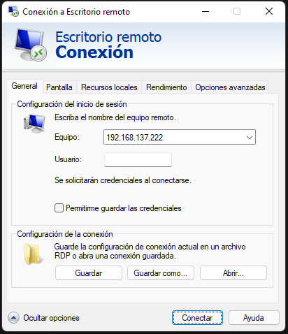
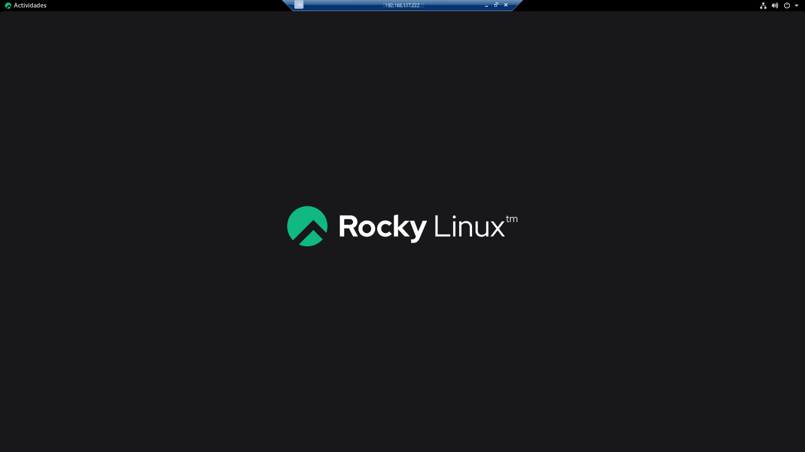

[](RockyLinux.md)


# Servicios remotos

## SSH, SCP y SFTP

Lo más normal es que usemos nuestro servidor de manera remota, por lo que usaremos algunos servicios remotos como ```SSH```, ```SFTP``` y ```SCP```.

Para instalar estos servicios tendremos que instalar ```SSH```, aunque ya nos lo encontramos instalado en nuestro sistema.

### Configuración de SSH

Es necesario que por seguridad configuremos algunos aspectos de SSH para que se prohiban los accesos al usuario root y las contraseñas vacías. Para ello, tendremos que abrir el archivo ```/etc/ssh/sshd_config``` y descomentar las líneas siguientes:

```bash 
PermitRootLogin no
PermitEmptyPasswords no
```

Y, para terminar, se reinicia el servicio: 

```bash
systemctl restart sshd
```

### Activando el log de SSH

Para activar el log de SSH tendremos que acceder al archivo ```/etc/ssh/sshd_config``` y modificar las líneas siguientes para que queden tal que así:

```bash
#Logging
SyslogFacility DAEMON
LogLevel DEBUG
```

Ahora sería interesante reiniciar el sistema o el servicio. Aunque siempre es más interesante reinciar el servicio:

```bash 
systemctl restart sshd
```

### Generando una contraseña en un cliente para acceder al servidor

Para general las claves públicas y privadas debemos hacer lo siguiente:

```bash 
# Generar claves pública y privada en el directorio /home/root/.ssd
ssh-keygen -t rsa

# Acceder al directorio donde están las claves:
cd /root/.ssh

# Enviar al ordenador destino las claves para que se conecte sin pedirle la contraseña.
ssh-copy-id -i id_rsa.pub SERVER_USERNAME@SERVER_IP
```

### Funcionamiento de SFTP

Este servicio viene con SSH, por lo que no hay que instalar nada. Sólo tenemos que saber como usarlo.

Para conectarnos por Secure File Transfer Protocol usaremos el siguiente comando:

```bash
sftp REMOTE_USER@REMOTE_IP
```

### Funcionamiento de SCP

Este servicio también viene con SSH, por lo tanto, no tendremos que instalar nada.

Para conectarnos por SCP usaremos el siguiente comando:

```bash
scp <-P <puerto>> <ruta de archivo local> REMOTE_USER@REMOTE_IP:<ruta destino>
```

## VNC

VNC es un programa de software libre basado en una estructura cliente-servidor que permite observar las acciones del ordenador servidor remotamente a través de un ordenador cliente. VNC no impone restricciones en el sistema operativo del ordenador servidor con respecto al del cliente: es posible compartir la pantalla de una máquina con cualquier sistema operativo que admita VNC conectándose desde otro ordenador o dispositivo que disponga de un cliente VNC portado.

Esto nos puede ser insteresante de instalar por el mismo motivo que hemos instalado SSH, para acceder remotamente a nuestro servidor. Pero, en este caso, para tener acceso al escritorio.

### Instalación del servidor VNC y revisión del firewall

Lo primero que tendremos que hacer será actualizar el sistema e instalar VNC:

```bash
dnf update -y
dnf install -y tigervnc-server tigervnc-server-module
```

Ahora tendríamos que habilitar el paso por el firewall:

```bash
firewall-cmd --add-service=vnc-server
firewall-cmd --runtime-to-permanent
```

### Estableciendo un passwd y configurando el servidor VNC

Lo primero que haremos tras la instalación de VNC será crear un nuevo usuario con el comando ```useradd vncuser``` y establecer una contraseña para dicho usuario con ```passwd vncuser```. Luego nos loguearemos en dicho usuario y con ```vncpasswd``` crearemos una contraseña para establecer la conexión remota. Tras esto crearemos el archivo de configuración ubicado en ```~/.vnc/config``` y lo editaremos.

```bash
## VNC Config File
session=gnome
securitytypes=vncauth,tlsvnc
desktop=sandbox
geometry=1024x768
alwaysshared
```

Ahora tendríamos que configurar los usuarios editando un fichero de configuración en ```/etc/tigervnc/vncserver.users```. Yo he añadido esto al final del archivo:

```bash
# Importante:
# El número de display 1 escucha en el puerto 5901
# Esto se debe a esta fórmula matemática:
# display_number + 5900 = puerto_de_escucha
# 
# Y la sintaxis es la siguiente:
# <display>=<username>
:1=vncuser
```

Finalmente, reiniciamos el servicio y lo habilitamos en el arranque:

```bash
systemctl restart vncserver@:1.service
systemctl start vncserver@:1.service
```

### Instalación del cliente VNC en nuestro cliente Rocky

Para instalar el cliente de VNC en nuestro cliente Rocky podremos hacer varias cosas. 

Una opción sería introducir los siguientes comandos en la consola para instalar TigerVNC Client:

```bash
dnf update -y
dnf install -y tigervnc
```

La otra opción sería descargarnos VNC Client e instalarlo en nuestra máquina, que es lo que yo he hecho porque es con lo que suelo trabajar para conectarme a mi PC de manera remota:

```bash
# Descargamos el paquete:
wget https://www.realvnc.com/download/file/viewer.files/VNC-Viewer-6.21.920-Linux-x64.rpm -O VNC-Viewer.rpm

# Instalamos el paquete:
dnf install -y VNC-Viewer.rpm
```

Ahora ya tendríamos el cliente VNC funcionando y nos podríamos conectar:



## RDP

<center></center>

RDP es un servicio de escritorio remoto.

Podemos instalar y configurar RDP mediante el uso de este script:

```bash
wget https://raw.githubusercontent.com/Jordilavila/dotfiles/main/RockyLinux/install_files/install_rdp.sh
sh install_rdp.sh
```

Por otra parte, podemos instalar y configurar RDP mediante comandos. Para instalarlo introduciremos el siguiente comando:

```bash
dnf install -y xrdp
```

Y ahora vendría la configuración:

```bash
systemctl enable xrdp
systemctl start xrdp
firewall-cmd --add-port=3389/tcp
firewall-cmd --runtime-to-permanent
systemctl restart xrdp
```

Finalmente, nos conectamos mediante la aplicación de escritorio remoto de Windows:


