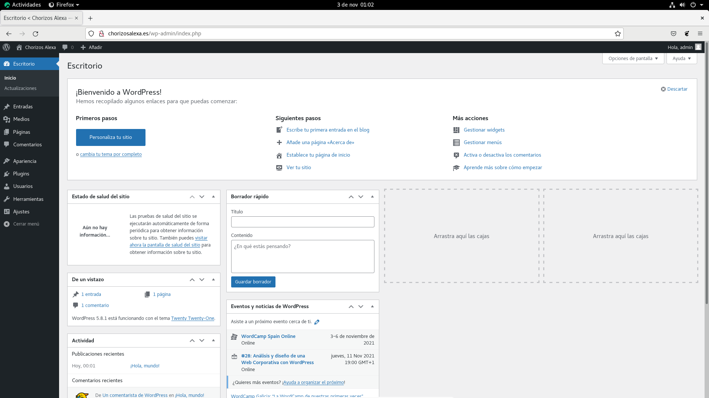

[](RockyLinux.md)  


# Servicios de Web y Base de datos

## Servidor MySQL - MariaDB

Vamos a instalar y configurar MariaDB en nuestra máquina Rocky Linux. MariaDB es un servidor de bases de datos relacionales.

### Instalación 

Para llevar a cabo la instalación de MariaDB tenemos que escalar privilegios en la consola y escribir el comando de instalación:

```bash
dnf -y install mariadb-server mariadb
```

Tras esto, debemos levantar el servicio con ```systemctl start mariadb``` y habilitarlo con ```systemctl enable mariadb```.

Ahora tocaría darle las instrucciones para que se instale:

```bash
# Instalación segura
mysql_secure_installation

# Acceder al servidor
mysql -u root -p
```

### Habilitando los logs en MariaDB

Para habilitar los logs tendremos que estar en la consola de MariaDB y escribir la siguiente batería de comandos:

```sql
-- Indicamos que la salida de los logs será en un archivo:
SET GLOBAL log_output = 'FILE';

-- Especificamos la ruta del archivo donde se guardarán los logs:
SET GLOBAL general_log_file='/var/log/mariadb/mariadb.log';

-- Habilitamos los logs
SET GLOBAL general_log = 'ON';
```

El nivel de _verbosity_ de los logs está establecido en 1 por defecto, pero tenemos 3 niveles: 1, 2 y 3. Para cambiar de nivel será tan sencillo como escribir el siguiente comando con el nivel necesitado, yo lo he dejado por defecto:

```sql
-- Verbosity level
SET GLOBAL log_warnings = 1;
```

### Creando una base de datos y su única tabla de pruebas:

Ahora podríamos crear una base de datos SQL:

```sql
CREATE DATABASE rockydb;

USE rockydb;

CREATE TABLE rockytable (
  opsys varchar(100),
  used_in_practice_1 varchar(20),
  used_in_practice_2 varchar(20),
  used_in_practice_3 varchar(20),
  primary key (opsys)
);

INSERT INTO rockytable values ('Rocky Linux', 'yes', 'yes', 'yes');
INSERT INTO rockytable values ('FreeBSD', 'yes', 'yes', 'yes');
INSERT INTO rockytable values ('Windows Server 2022', 'yes', 'yes', 'yes');
INSERT INTO rockytable values ('Manjaro', 'yes', 'no', 'no');
INSERT INTO rockytable values ('OpenSUSE', 'yes', 'no', 'no');
INSERT INTO rockytable values ('Debian', 'yes', 'no', 'no');
INSERT INTO rockytable values ('ZorinOS', 'no', 'no', 'no');
INSERT INTO rockytable values ('Kali Linux', 'no', 'no', 'no');
INSERT INTO rockytable values ('Alpine Linux', 'no', 'no', 'no');
```

Leamos la tabla:

```sql
SELECT * FROM rockytable;
```


### Creando un usuario que pueda leer la tabla:

Ahora tenemos que crear un usuario y darle permisos para poder utilizarlo con el resto de software, como por ejemplo, un servidor PHP.

```sql
-- CREANDO EL USUARIO:
-- CREATE USER 'miusuario'@localhost IDENTIFIED BY 'mipassword';
CREATE USER 'phpuser'@localhost IDENTIFIED BY 'phpuser';

/* Ahora le podemos dar permisos para que acceda sólo desde esta máquina o para que acceda desde cualquier punto de la red */

-- Permisos desde la máquina:
-- GRANT USAGE ON *.* TO 'miusuario'@localhost IDENTIFIED BY 'mipassword';
GRANT USAGE, SELECT ON *.* TO 'phpuser'@localhost IDENTIFIED BY 'phpuser';

-- Permisos desde la red:
-- GRANT USAGE ON *.* TO 'miusuario'@'%' IDENTIFIED BY 'mipassword';
GRANT USAGE, SELECT ON *.* TO 'phpuser'@'%' IDENTIFIED BY 'phpuser';
```

En caso de querer darle todos los privilegios al usuario en cuestion, introduciríamos el siguiente comando. Esto no lo vamos a hacer porque sería bastante absurdo. Veamos el comando:

```sql
GRANT ALL privileges ON 'mibbdd'.* TO 'miusuario'@localhost;
```

Finalmente, aplicamos los cambios:

```sql
FLUSH PRIVILEGES;
EXIT;
```

Ahora lo suyo sería comprobar que funciona el usuario y que podemos leer la base de datos. Esto lo haríamos tal que así:

```bash
mysql -u phpuser -p
``` 

```sql
USE rockydb;
SELECT * FROM rockytable;
```

## Servidor Apache y PhpMyAdmin

Es interesante poder lanzar páginas web desde nuestro servidor, por lo que vamos a instalar Apache y lanzar dos webs. Una web nos mostrará la tabla de MariaDB que hemos creado en el punto anterior y otra web montará un CMS.

Para llevar a cabo todo esto, vamos a instalar Apache, PhpMyAdmin y todo el paquete PHP y, como CMS, Wordpress.

### Instalando Apache

Para poder llevar a cabo la implantación del servidor web, tendremos que habilitarlo. Para ello vamos a usar la siguiente batería de comandos:

```bash
# Actualizar sistema e instalar httpd
dnf update -y
dnf install -y httpd

# Habilitar servidor web
systemctl enable httpd
systemctl start httpd

# Permitir el paso a través del firewall
firewall-cmd --permanent --zone=public --add-service=http
firewall-cmd --permanent --zone=public --add-service=https
firewall-cmd --reload
```

### Activando el modo debug en Apache

Para activar los logs de apache, tendremos que dirigirnos al archivo ```/etc/httpd/conf/httpd.conf``` y cambiar la línea siguiente:

```bash
# Línea original:
LogLevel warn

# Línea final:
LogLevel debug
```

### Instalación de PHP y phpMyAdmin

En esta herramienta va a ser necesaria para poder imprimir la base de datos en el navegador. Podemos usar un script que he preparado para instalar PHP, pero ojo con el _warning_ que hay unas líneas más abajo:

```bash
wget https://raw.githubusercontent.com/Jordilavila/dotfiles/main/RockyLinux/install_files/install_php.sh
sh install_php.sh
```

Por otra parte, también podemos introducir los comandos nosotros mismos para instalar PHP:

```bash
dnf module reset php
dnf module enable php:7.4
dnf install -y php php-common php-opcache php-cli php-gd php-curl php-mysqlnd php-xml php-zip php-intl php-json php-ldap php-mbstring
```

Ahora descargamos y descomprimimos phpMyAdmin:

```bash
wget https://files.phpmyadmin.net/phpMyAdmin/5.1.1/phpMyAdmin-5.1.1-all-languages.zip
unzip phpMyAdmin-*-all-languages.zip

# Si unzip no está instalado lo instalamos así:
dnf install unzip -y
```

Ahora nos tocaría mover y cambiar de nombre el nuevo directorio con el siguiente comando:

```bash
mv phpMyAdmin-*-all-languages /usr/share/phpmyadmin
```

Una vez movido, cambiamos a dicho directorio y empezamos la configuración y puesta a punto de _phpMyAdmin_:

```bash
cd /usr/share/phpmyadmin
mv config.sample.inc.php config.inc.php
```

Ahora tendríamos que crear un nuevo directorio temporal con los permisos necesarios usando los comandos siguientes:

```bash
mkdir /usr/share/phpmyadmin/tmp
chown -R apache:apache /usr/share/phpmyadmin
chmod 777 /usr/share/phpmyadmin/tmp
```

:warning: Esto no lo hace el script de instalación.  
Finalmente, tendríamos que generar una clave de 32 bits, copiarla y añadirla en el archivo que hemos movido antes:

```bash
# Generar clave:
openssl rand -base64 32

# Abrir archivo:
nano config.inc.php

# Línea donde pegar la clave:
cfg['blowfish_secret'] = 'CLAVE';
```

### Creando los archivos de configuración de Apache

El siguiente paso va a ser configurar Apache. Para ello abrimos el archivo ```/etc/httpd/conf.d/phpmyadmin.conf``` y pegamos el fragmento de texto siguiente:

```bash
Alias /phpmyadmin /usr/share/phpmyadmin
<Directory /usr/share/phpmyadmin/>
   AddDefaultCharset UTF-8
   <IfModule mod_authz_core.c>
     # Apache 2.4
     <RequireAny>
      Require all granted
     </RequireAny>
   </IfModule>
</Directory>

<Directory /usr/share/phpmyadmin/setup/>
   <IfModule mod_authz_core.c>
     # Apache 2.4
     <RequireAny>
       Require all granted
     </RequireAny>
   </IfModule>
</Directory>
```

Tras esto, escribimos el siguiente comando y reiniciamos el servicio de Apache:

```bash
chcon -Rv --type=httpd_sys_content_t /usr/share/phpmyadmin/*

systemctl restart httpd
```

Finalmente, podemos acceder a phpMyAdmin en la dirección ```http://MI_IP/phpmyadmin```:


### Creando VirtualHosts

Los _VirtualHosts_ son dominios ficticios alojados en un mismo servidor. Es decir, para una misma IP tendremos más de una página web. Lo primero que vamos a hacer con los hosts virtuales será crear las carpetas con las que vamos a trabajar, para ello usaremos el siguiente bloque de comandos:

```bash 
## Creando las carpetas
mkdir -p /var/www/databasereader.host/html
mkdir -p /var/www/chorizosalexa.es/html

## Cambiando el propietario a apache
chown -R apache:apache /var/www/databasereader.host/html
chown -R apache:apache /var/www/chorizosalexa.es/html

## Cambiando los permisos de las carpetas
chmod -R 755 /var/www
```

Ahora vamos a colocar una página de prueba en cada una de las carpetas en cuestión:

```bash
touch /var/www/databasereader.host/html/index.html
echo "Welcome to databasereader.host" >> /var/www/databasereader.host/html/index.html

touch /var/www/chorizosalexa.es/html/index.html
echo "Welcome to chorizosalexa.es" >> /var/www/chorizosalexa.es/html/index.html
```

Ahora tendríamos que habilitar estos host virtuales en el archivo de configuración. Para ello abrimos el archivo ```/etc/httpd/conf/httpd.conf``` y añadimos al final el bloque siguiente:

```bash
# DatabaseReader VirtualHost
<VirtualHost *:80>
  ServerName www.databasereader.host
  ServerAlias databasereader.host
  DocumentRoot /var/www/databasereader.host/html
  ErrorLog /var/www/databasereader.host/error.log
  CustomLog /var/www/databasereader.host/request.log combined
</VirtualHost>

# Chorizos Alexa VirtualHost
<VirtualHost *:80>
  ServerName www.chorizosalexa.es
  ServerAlias chorizosalexa.es
  DocumentRoot /var/www/chorizosalexa.es/html
  ErrorLog /var/www/chorizosalexa.es/error.log
  CustomLog /var/www/chorizosalexa.es/request.log combined
</VirtualHost>
```

Tras esto, tendremos que reiniciar Apache y nos saldrá un error que no nos permitirá volver a levantar el servidor, para corregir esto, tendremos que usar estos comandos y funcionará todo:

```bash
setenforce 0
systemctl restart httpd
systemctl status httpd
```

Este comando será para un funcionamiento temporal, por lo que tendremos que hacerlo permanente accediendo al archivo ```/etc/sysconfig/selinux``` y editando la línea siguiente:

```bash
# Línea original:
SELinux=enforcing

# Línea a establecer:
SELinux=permissive
```

Finalmente, reiniciamos el sistema.

Una vez tenemos el servidor web funcionando, tendremos que editar el archivo ```/etc/hosts``` y cambiar la línea del localhost tal que así:

```bash
# Línea original
127.0.0.1   localhost localhost.localdomain localhost4 localhost4.localdomain4

# Línea final
127.0.0.1   localhost localhost.localdomain localhost4 localhost4.localdomain4 chorizosalexa.es www.chorizosalexa.es databasereader.host www.databasereader.host
```

Ahora podríamos acceder a las dos webs desde el navegador del servidor sin ningún problema.

Ahora bien, ¿y si queremos que nuestra web sea php? No habría ningún problema mientras PHP esté instalado en el servidor. Lo que tendríamos que hacer es cambiar el archivo ```index.html``` por un ```index.php``` y funcionaría igual.

### Creando una web en PHP que lea la base de datos

Una de las misiones que tenemos tras haber creado una base de datos en MariaDB o MySQL es mostrar la tabla que hemos creado en el navegador y esto lo podemos hacer mediante PHP. Para ello he preparado este archivo que guardaremos como index.php en el host virtual que corresponda:

```php
<!DOCTYPE HTML>
  <html>
  <body>
    <?php

      $hostname = "localhost";
      $username = "phpuser";
      $password = "phpuser";
      $db = "rockydb";

      $dbconnect=mysqli_connect($hostname,$username,$password,$db);

      if ($dbconnect->connect_error) {
        die("Database connection failed: " . $dbconnect->connect_error);
      }
    ?>

    <table border="1" align="center">
      <tr>
        <td>Operating System</td>
        <td>Used in P1</td>
        <td>Used in P2</td>
        <td>Used in P3</td>
      </tr>

      <?php
        $query = mysqli_query($dbconnect, "SELECT * FROM rockytable")
           or die (mysqli_error($dbconnect));

        while ($row = mysqli_fetch_array($query)) {
          echo
           "<tr>
              <td>{$row['opsys']}</td>
              <td>{$row['used_in_practice_1']}</td>
              <td>{$row['used_in_practice_2']}</td>
              <td>{$row['used_in_practice_3']}</td>
           </tr>\n";
        }
      ?>
    </table>
  </body>
</html>
```

Finalmente, reiniciamos el servidor web con ```systemctl restart httpd``` y volvemos a acceder a la web. Tendremos pintada la tabla de la base de datos que habríamos creado anteriormente. En caso de no salir la base de datos, pulsamos en el teclado ```CTRL + F5``` para que se refresque toda la página.


### Creando una segunda web con Wordpress

Lo primero que haremos será acceder a la consola de MariaDB o MySQL:

```bash
# Accedemos a mysql:
mysql -u root -p
```

Acto seguido, creamos una base de datos, un usuario y le damos privilegios:

```sql
CREATE DATABASE wordpress_db;
CREATE USER 'wordpress_user'@'localhost' IDENTIFIED BY 'wordpress_user';
GRANT ALL ON wordpress_db.* TO 'wordpress_user'@'localhost';
FLUSH PRIVILEGES;
EXIT;
```

Ahora nos tendríamos que descargar Wordpress y descomprimirlo. Después lo moveremos a la carpeta del VirtualHost de _chorizosalexa.es_:

```bash
wget https://wordpress.org/latest.tar.gz -O wordpress.tar.gz
tar -xvf wordpress.tar.gz

# Primero vamos a borrar el index.html de chorizosalexa.es
rm -f /var/www/chorizosalexa.es/html/index.html

# Ahora movemos el directorio:
cp -R wordpress /var/www/chorizosalexa.es/html

# Ahora ya podemos borrar lo que nos hemos descargado y descomprimido:
rm -Rf wordpress.tar.gz wordpress
```

Ahora le damos permisos a apache sobre esa carpeta:

```bash
chown -R apache:apache /var/www/chorizosalexa.es
chmod -R 775 /var/www/chorizosalexa.es
```

El paso siguiente será revisar el virtualhost de chorizosalexa.es. Cabe recordar que la ruta es ```/etc/httpd/conf/httpd.conf```. El virtualhost debería de quedar parecido a este:

```bash
# Chorizos Alexa VirtualHost
<VirtualHost *:80>
  ServerName www.chorizosalexa.es
  ServerAlias chorizosalexa.es
  DocumentRoot /var/www/chorizosalexa.es/html/wordpress
  ErrorLog /var/www/chorizosalexa.es/error.log
  CustomLog /var/www/chorizosalexa.es/request.log combined
</VirtualHost>
```

Tras esto reiniciamos el servicio de apache con ```systemctl restart httpd``` y entramos a la dirección web. Bienvenidos a la página de configuración del CMS:


Tras seleccionar el idioma nos pedirá datos sobre la base de datos para poderse conectar y tendremos que darle algo de información como el nombre del sitio y crear un usuario administrador. Yo le he puesto ```admin//admin``` puesto que esto es una mera demostración.

Tras acceder con el usuario de administrador se nos abrirá el panel de control de Wordpress:



### Creando una tercera web con Joomla

Por otra parte, en caso de querer instalar Joomla 