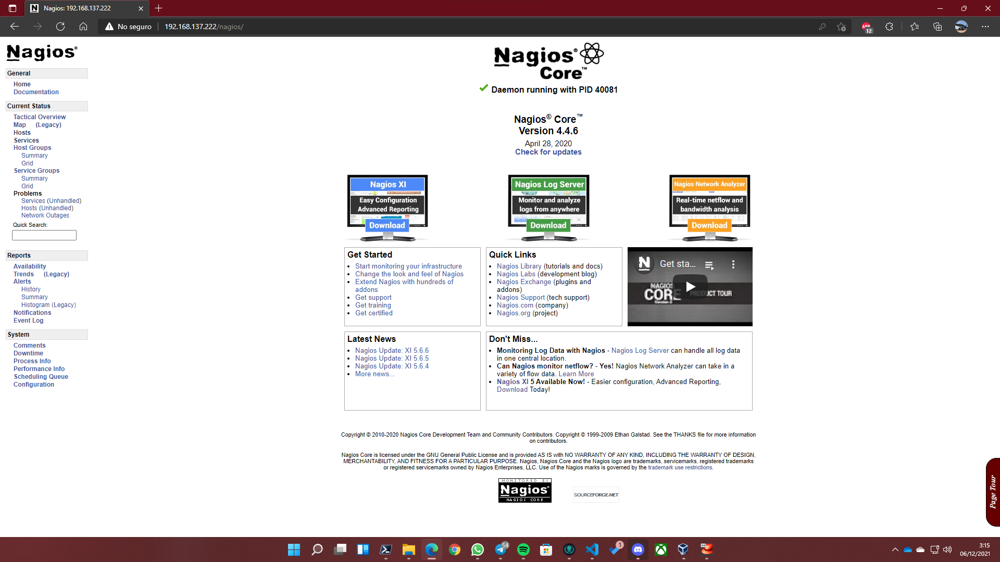

[](RockyLinux.md)

# NAGIOS

Nagios es un sistema de monitorización de redes que vigila los equipos y los servicios que se especifiquen, alertando cuando el comportamiento de los mismos no sea el deseado. Entre sus características principales figuran la monitorización de servicios de red, la monitorización de los recursos de sistemas hardware (carga de la cpu, uso de discos, etc.), independencia de sistemas operativos, etc.

Este software es bastante versátil para consultar prácticamente cualquier parámetro de interés de un sistema, y genera alertas que se pueden recibir por email y SMS. Otro dato interesante es que se consulta en una web en PHP que montamos en el servidor.

Para instalar Nagios, podremos hacerlo con un script que he preparado o paso por paso.

## Preparando las dependencias

### Usando el script

Para usar el script será tan sencillo como hacer uso de los siguientes comandos:

```bash
# Run as root
wget https://raw.githubusercontent.com/Jordilavila/dotfiles/main/RockyLinux/install_files/install_nagios.sh
sh install_nagios.sh
```

El script acaba con la descompresión de la carpeta de Nagios.

### Usando los comandos

Lo primero que haremos será una actualización del sistema y luego instalaremos las dependencias. Finalmente, descargaremos nagios y lo descomprimiremos. Exactamente igual que se haría con el script:

```bash
# Instalación de dependencias:
dnf install -y php perl @httpd wget unzip glibc automake glibc-common gettext autoconf php php-cli gcc gd gd-devel net-snmp openssl-devel unzip net-snmp postfix net-snmp-utils
dnf -y groupinstall "Development Tools"
systemctl enable --now httpd php-fpm
systemctl start httpd
systemctl start php-fpm

# Descargamos el código de nagios:
wget https://assets.nagios.com/downloads/nagioscore/releases/nagios-4.4.6.tar.gz -O nagios.tar.gz
tar -xzf nagios.tar.gz
```

## Configuración previa de Nagios

Una vez listo, entramos a la carpeta de nagios y ejecutamos el comando ```./configure```, donde veremos la información que recogerá nagios para compilarse en nuetro sistema. Finalmente, haremos uso del comando ```make all```.

Ahora nos tocará crear un usuario para nagios con el comando ```make install-groups-users```. Finalmente, añadiremos un usuario de apache al grupo de nagios con el comando ```usermod -aG nagios apache```.

## Instalación de nagios en la máquina

Para instalar nagios haremos uso de los siguientes comandos:

```bash
make install
make install-init
make install-daemoninit
make install-commandmode
make install-config
make install-webconf
```

## Creando el usuario web de nagios

Para crear dicha cuenta de usuario haremo suso de los siguientes comandos:

```bash
htpasswd -c /usr/local/nagios/etc/htpasswd.users nagiosadmin
chown apache:apache /usr/local/nagios/etc/htpasswd.users
chmod 640 /usr/local/nagios/etc/htpasswd.users
systemctl restart httpd
firewall-cmd --add-port=80/tcp --permanent
firewall-cmd --reload
systemctl enable nagios --now
```

Nota: Por defecto, el usuario es nagiosadmin. En caso de que usemos un nombre de usuario distinto, tendremos que reemplazar todas las instancias de _nagiosadmin_ en el archivo ```/usr/local/nagios/etc/cgi.cfg```.

Finalmente ya tenemos nagios configurado en Rocky Linux:



