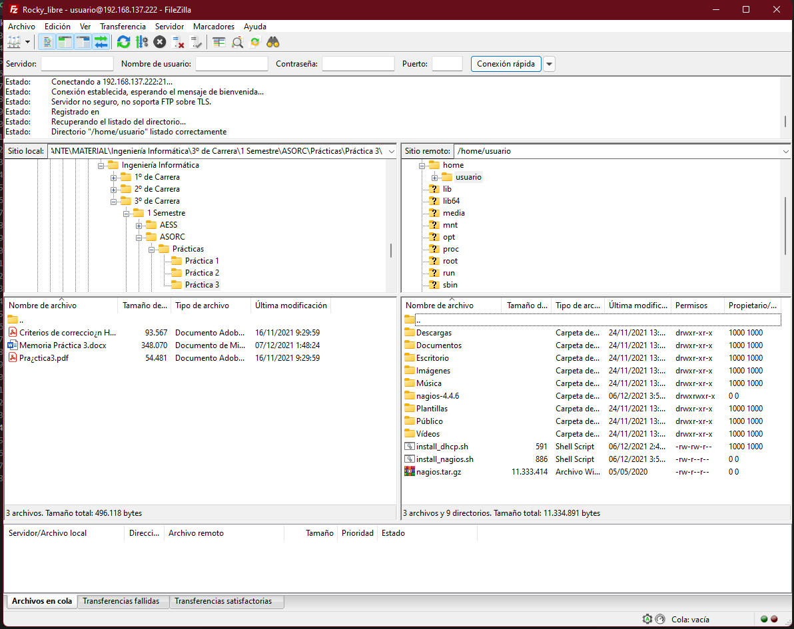
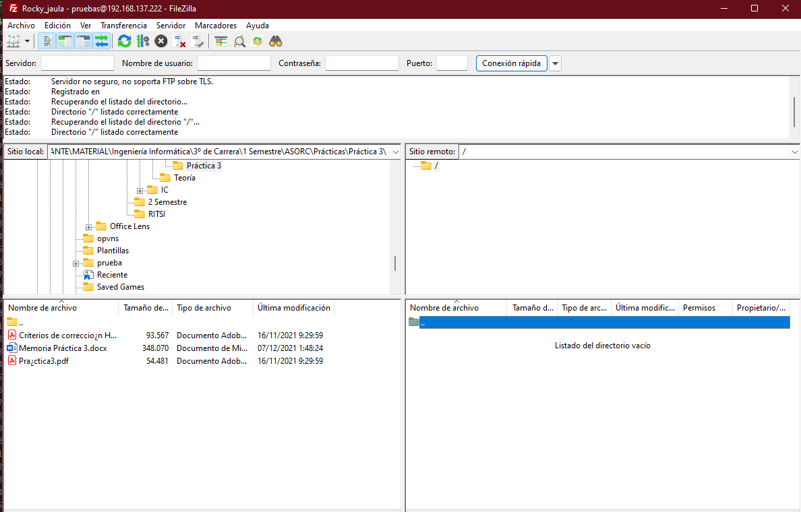

[](RockyLinux.md)

# Servidor FTP

Vamos a instalar un servidor FTP en Rocky Linux mediante ```vsftpd```. También vamos a ver dos configuraciones posibles:

    - Usuario libre (tendrá acceso a todo el disco)
    - Usuario enjaulado (sólo podrá acceder donde nosotros queramos)

## Instalación del Servidor FTP

Para instalar el servidor FTP haremos uso de los siguientes comandos:

```bash
dnf install -y vsftpd
```

Tras esto, tendremos que acceder al archivo de configuración para realizar unos pequeños cambios. El archivo de configuración es ```/etc/vsftpd/vsftpd.conf``` y los cambios son los siguientes:

```bash
ascii_upload_enable=YES
ascii_download_enable=YES

chroot_local_user=YES
chroot_list_enable=YES

chroot_list_file=/etc/vsftpd/chroot_list

ls_recurse_enable=YES

listen=YES

listen_ipv6=NO

##########

## Added by me:
# Directorio root 
user_sub_token=$USER
local_root=/var/www/ftp/$USER
# Tiempo local
use_localtime=YES
# Apagar el filtro seccomp (descomentar si no podemos loggearnos)
seccomp_sandbox=NO
```

## Configuración del servicio

Ahora nos tocará añadir a nuestro usuario al archivo donde se configuran los usuarios que tienen el acceso permitido a todo el disco. Este archivo no se crea por defecto en la instalación, por lo que tendremos que crearlo nosotros tal que así: ```touch /etc/vsftpd/chroot_list```.

```bash
# Con este comando, aunque estemos con privilegios escalados, añadiremos al usuario con el que nos hemos logueado inicialmente.
echo $USER >> /etc/vsftpd/chroot_list
```

Ahora habilitamos el servicio y lo lanzamos:

```bash 
systemctl enable vsftpd
systemctl restart vsftpd
```

Finalmente, tenemos que permitir el paso del servicio a través del firewall:

```bash
firewall-cmd --add-service=ftp
firewall-cmd --runtime-to-permanent
```

Ahora ya podríamos conectarnos a nuestro usuario principal y acceder a todo el disco:



## Usuario enjaulado

Para poder establecer como enjaulado a un usuario, lo primero que tendremos que hacer será crearlo, tal que así:

```bash
useradd pruebas
passwd pruebas
# Nos pedirá la contraseña, le he puesto pruebas
```

Tras crear el usuario, tendremos que añadir en el archivo de configuración de _vsftpd_ la instrucción para habilitarlo:

```bash
echo "# Habilitar usuario enjaulado" >> /etc/vsftpd/vsftpd.conf
echo "allow_writeable_chroot=YES" >> /etc/vsftpd/vsftpd.conf

mkdir /var/www/ftp
mkdir /var/www/ftp/pruebas

# Usuario logueado: mkdir /var/www/ftp/$USER

systemctl restart vsftpd
```

Y ahora ya podríamos hacer uso de este usuario.

Cabe destacar que con la configuración que he hecho en el archivo destinado para ese fin, cualquier usuario que tenga su directorio creado en la ruta del server FTP (```/var/www/ftp/```) tendrá acceso a su carpeta, puesto que lo he creado dinámico.


