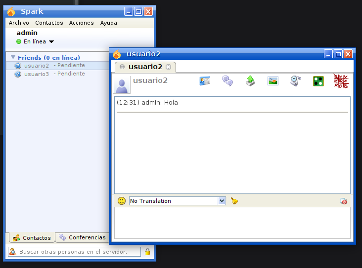

[](RockyLinux.md)

# Mensajería instantánea (_OpenFire_)

Para instalar un servidor de mensajería instantánea podemos usar OpenFire.

La instalación de OpenFire se podrá llevar a cabo siguiendo estos comandos:

```bash
# Descargamos e instalamos OpenFire:
wget https://www.igniterealtime.org/downloadServlet?filename=openfire/openfire-4.6.4-1.x86_64.rpm -O openfire.rpm
rpm -ivh openfire.rpm

systemctl enable openfire
systemctl restart openfire
```

OpenFire se encuentra trabajando en el puerto 9090, por lo que tendremos que conectarnos desde el navegador de la propia máquina virtual a la dirección ```http://localhost:9090/setup/index.jsp```. Con esto entraremos a la configuración del servicio. Tras esto podremos acceder al servicio.

Como dato importante y a destacar: tenemos la opción de que OpenFire cree su propia base de datos automáticamente. Luego tendremos que crear los usuarios y, finalmente, establecer nuevas reglas para el Firewall:

```bash
firewall-cmd --zone=public --add-port=9090/tcp --permanent
firewall-cmd --permanent --add-port=5222/tcp --permanent
firewall-cmd --reload
```

## Instalación del cliente (_Spark_)

Para instalar _Spark_ (cliente) usaremos los siguientes comandos:

```bash
dnf install -y java
wget https://www.igniterealtime.org/downloadServlet?filename=spark/spark-2.9.4.rpm -O spark.rpm
rpm -ivh spark.rpm
```

En la conexión de Spark tendremos que ir a la sección de _Avanzado_ y decirle que no use certificados. Luego podremos iniciar sesión sin ningún problema.



