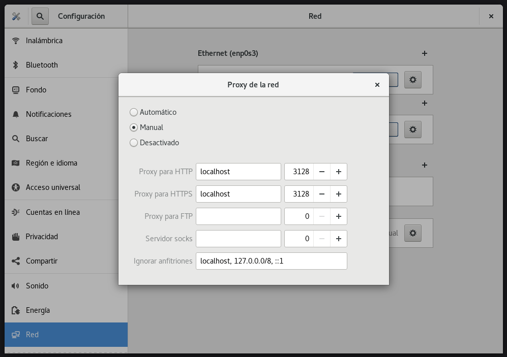
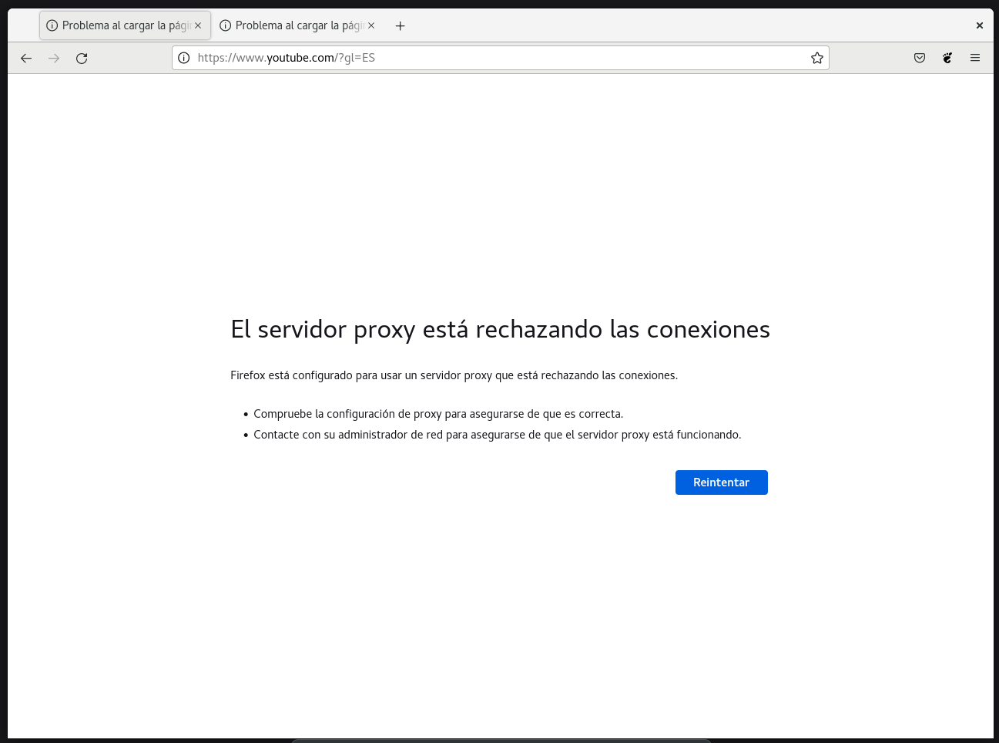

[](RockyLinux.md)

# Proxy (_Squid_)

Un proxy es una tecnología que se utiliza como puente entre el origen (un ordenador) y el destino de una solicitud (Internet). Generalmente se trata de un dispositivo u ordenador intermedio que nos permite conectarnos a Internet de manera directa.

Nosotros vamos a usar el proxy para restringir el acceso a determinados sitios web.

Empezaremos la instalación con:

```bash
dnf install -y squid
```

Ahora tendremos que acceder al archivo de configuración que se encuentra en ```/etc/squid/squid.conf``` y añadimos las siguientes reglas:

```bash
#
# INSERT YOUR OWN RULE(S) HERE TO ALLOW ACCESS FROM YOUR CLIENTS
#
acl blocksitelist dstdomain "/etc/squid/blockwebsites.lst"
http_access deny blocksitelist

acl blockkeywordlist url_regex "/etc/squid/blockkeywords.lst"
http_access deny blockkeywordlist
```

```bash
# Example rule allowing access from your local networks.
# Adapt localnet in the ACL section to list your (internal) IP networks
# from where browsing should be allowed
http_access allow localnet
#http_access allow localhost

# And finally deny all other access to this proxy
#http_access deny all
http_access allow all
```

Ahora tendremos que cambiar la máscara de red de la IP con la que nos conectamos a Internet (10.0.0.0). Tiene que quedar tal que así (principio del archivo):

```bash
acl localnet src 10.0.0.0/24        # RFC 1918 local private network (LAN)
```

## Creando las listas negras

Ahora procedemos a crear las listas negras del proxy, es decir, los ficheros que contienen las webs o las palabras que el proxy va a prohibir. Para ello he hecho esto:

```bash
echo "www.youtube.es" > /etc/squid/blockwebsites.lst
echo "www.youtube.com" >> /etc/squid/blockwebsites.lst
echo "netflix" > /etc/squid/blockkeywords.lst
```

Esto quiere decir que he bloqueado el acceso a _YouTube_ y a todo lo relacionado con _Netflix_. Para poderlo comprobar tendremos que habilitar el proxy:

```bash
systemctl enable squid
systemctl restart squid
``` 

Pero esto no es todo, ahora tendremos que decirle a la máquina que use el proxy. Para ello nos vamos a la configuración de red del sistema y dejamos la opción del proxy tal que así:



Ahora no habrá manera de conectarse a YouTube ni a Netflix:




