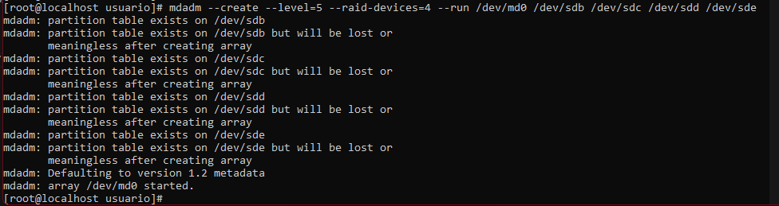

[](RockyLinux.md)

# RAID

Un _grupo o matriz redundante de discos independientes_ o RAID es un sistema de almacenamiento de datos que utiliza múltiples unidades, entre las que se distribuyen o se replican datos.

En función de su configuración (nivel) tendremos unos beneficios u otros, entre los que podemos encontrar: mayor integridad, tolerancia frente a fallos, tasa de transferencia y capacidad. Originalmente se buscaba combinar varios dispositivos de bajo coste y tecnología más vieja en un conjunto que ofrecía más capacidad, fiabilidad, velocidad o una combinación de éstas, para no usar un dispositivo de última generación y de mayor coste.

Los RAID más importantes que nos podemos encontrar son el RAID0, RAID1 y RAID5, entre muchos otros. Nosotros vamos a trabajar con el RAID5 y como simplemente vamos a demostrar su uso, vamos a crear cuatro discos duros de uno o dos gigabytes y montaremos el RAID con ellos.

Para combrobar que Rocky puede leer los discos, usaremos el comando ```fdisk -l```. Después, entraremos a cada disco con el comando ```fdisk /dev/sdX``` para acceder al modo de administración del disco y poder formatearlo. La batería de comandos que usaremos serán los siguientes:

```bash
p ## Particionado de disco
n ## Nueva partición
t ## Cambiar partición
L ## Listar los tipos de particiones (buscamos fd, que corresponde a Linux Raid Autodetect)
w ## Escribir los cambios
```

## Construcción del RAID

En nuestro caso, el sistema establece los discos duros como SDA para el principal del sistema y los del RAID son SDB, SDC, SDD y SDE. Para construir el RAID haremos uso del siguiente comando:

```bash
mdadm --create --level=5 --raid-devices=4 --run /dev/md0 /dev/sdb /dev/sdc /dev/sdd /dev/sde
```

Tras esto, ya tenemos el RAID5 creado y empezará a montarse:



Para ver el proceso podemos usar el siguiente comando:

```bash
mdadm --detail /dev/md0
```

Y tendremos una salida similar a esta:

```bash
/dev/md0:
             Version : 1.2
       Creation Time : Tue Dec  7 16:51:33 2021
          Raid Level : raid5
          Array Size : 3139584 (2.99 GiB 3.21 GB)
       Used Dev Size : 1046528 (1022.00 MiB 1071.64 MB)
        Raid Devices : 4
       Total Devices : 4
         Persistence : Superblock is persistent

         Update Time : Tue Dec  7 16:51:43 2021
               State : clean
      Active Devices : 4
     Working Devices : 4
      Failed Devices : 0
       Spare Devices : 0

              Layout : left-symmetric
          Chunk Size : 512K

  Consistency Policy : resync

                Name : localhost.localdomain:0  (local to host localhost.localdomain)
                UUID : 63703586:65bbd91f:ba318294:06459119
              Events : 18

    Number   Major   Minor   RaidDevice State
       0       8       16        0      active sync   /dev/sdb
       1       8       32        1      active sync   /dev/sdc
       2       8       48        2      active sync   /dev/sdd
       4       8       64        3      active sync   /dev/sde
```

## Preparando el RAID para su uso

Antes de poder usar nuestro RAID lo tendremos que formatear y montarlo. Para ello usaremos los siguientes comandos:

```bash 
mkfs -t ext4 /dev/md0
mkdir /raid
mount -t ext4 /dev/md0 /raid
```

Como ya tenemos el RAID montado en el sistema, podemos crear un archivo en él:

```bash
echo "Hola" > /raid/elpepe.txt
```

## Comprobando la integridad del RAID

No todo consiste en montar cosas y ya, también tenemos que comprobar su integridad, sobre todo con un RAID. Esto no es ni más ni menos que fastidiar un disco duro en caliente y volverlo a conectar.

```bash
# Romper el disco
mdadm -f /dev/md0 /dev/sde

# Comprobamos el estado de manera corta
cat /proc/mdstat

# Comprobamos que podemos leer el archivo que habíamos creado
cat /raid/elpepe.txt

# Quitamos el disco por completo
mdadm -r /dev/md0 /sde

# Volvemos a añadir el disco
mdadm -a /dev/md0 /dev/sde

# Comprobamos de nuevo el estado del disco
cat /proc/mdstat
```


