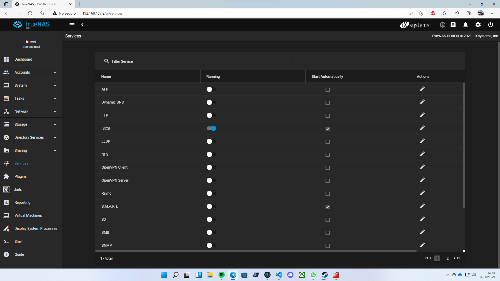

# TrueNAS

TrueNAS es un sistema operativo basado en FreeBSD que nos trae montado un servidor NAS. La instalación del operativo es similar a la de FreeBSD. Se recomienda un mínimo de 8GBs de memoria RAM y el uso de varias particiones para no guardar datos en el mismo sitio que el sistema.

## Instalación

La instalación de TrueNAS es relativamente sencilla y similar a la de FreeBSD, sólo tenemos que seguir los pasos y tendremos el sistema instalado.

## Activando iSCSI

El procotolo iSCSI sirve para conectar discos duros a nuestro servidor NAS. Para activarlo tendremos que aceder al panel de control desde el navegador y activarlo la sección de servicios.

