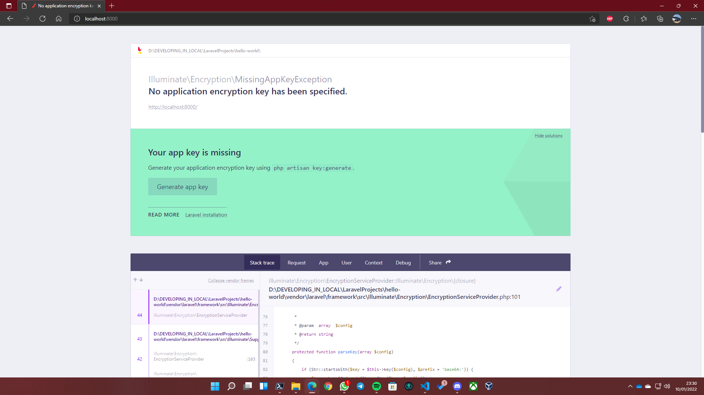

# Instalación y creación de un proyecto de Laravel

Laravel es un _framework_ de PHP.

## Requisitos

Para poder usar Laravel tendremos que tener instalados los siguientes requisitos:

- [Chocolatey](Chocolatey.md)
- [MariaDB (MySQL)](MariaDB.md)
- [Composer](Composer.md)
- PHP 8

Como resumen de la instalación con Chocolatey:

```Powershell
choco install -y mariadb php composer
```

## Instalar Laravel en Windows y añadirlo al Path

Para llevar a cabo esta tarea será tan sencillo como ejecutar el siguiente comando:

```Powershell
composer global require "laravel/installer"
```

Tras esto, si ejecutamos ```laravel``` en la consola, debería salirnos algo parecido a esto:

```Powershell
Laravel Installer 4.2.9

Usage:
  command [options] [arguments]

Options:
  -h, --help            Display help for the given command. When no command is given display help for the list command
  -q, --quiet           Do not output any message
  -V, --version         Display this application version
      --ansi|--no-ansi  Force (or disable --no-ansi) ANSI output
  -n, --no-interaction  Do not ask any interactive question                                                               
  -v|vv|vvv, --verbose  Increase the verbosity of messages: 1 for normal output, 2 for more verbose output and 3 for debug
  
Available commands:
  completion  Dump the shell completion script
  help        Display help for a command
  list        List commands
  new         Create a new Laravel application
```

## Crear el _Hello World!_

Para crear nuestro primer proyecto de Laravel deberemos acceder a la carpeta donde lo queremos almacenar y escribir lo siguiente:

```Powershell
laravel new hello-world

# Tras entrar al directorio:
composer install
    # Esto último tendremos que hacerlo cada vez que ejecutemos el proyecto en una máquina distinta

# Levantamos el servicio (localhost:8000):
php artisan serve
```

Tras esto, Laravel creará el proyecto en el directorio especificado. Cuando termine lo podremos abrir con Visual Studio Code o el editor de preferencia y lo tendremos corriendo en el puerto 8000.




