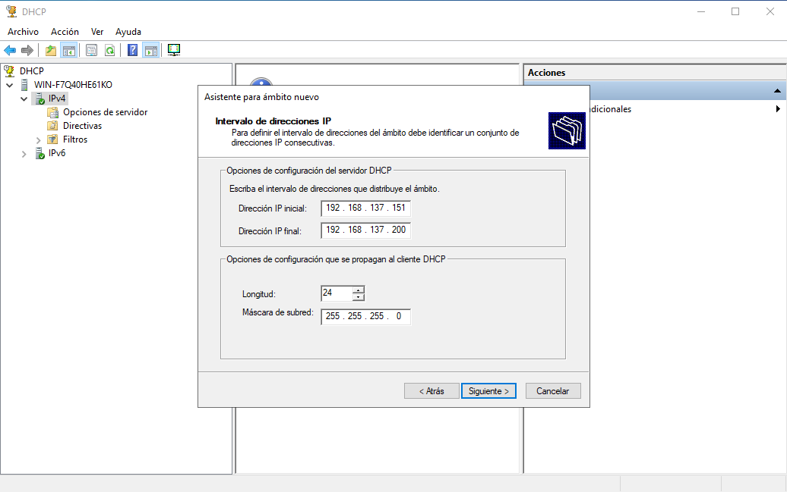

# Servicios de Red

## DHCP

Este servicio lo podemos instalar mediante el panel del _Administrador de Servidor_ de Windows Server. Tras instalar el servidor de DHCP tendremos que configurar el servidor y lo más importante y relevante será el intervalo de direcciones IP que puede dar el servidor. 

La instalación no tiene pérdida ni ninguna dificultad.

## DNS

## GIT

## OwnCloud