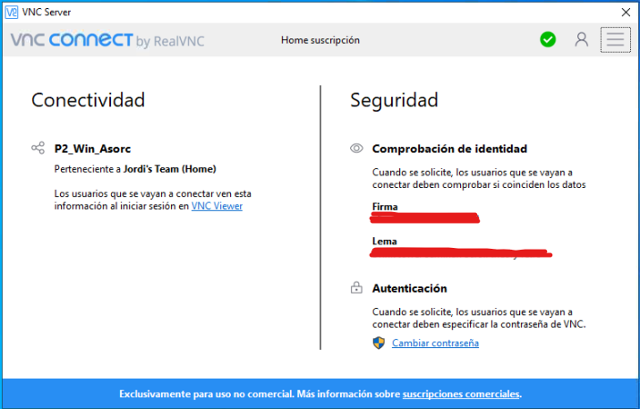
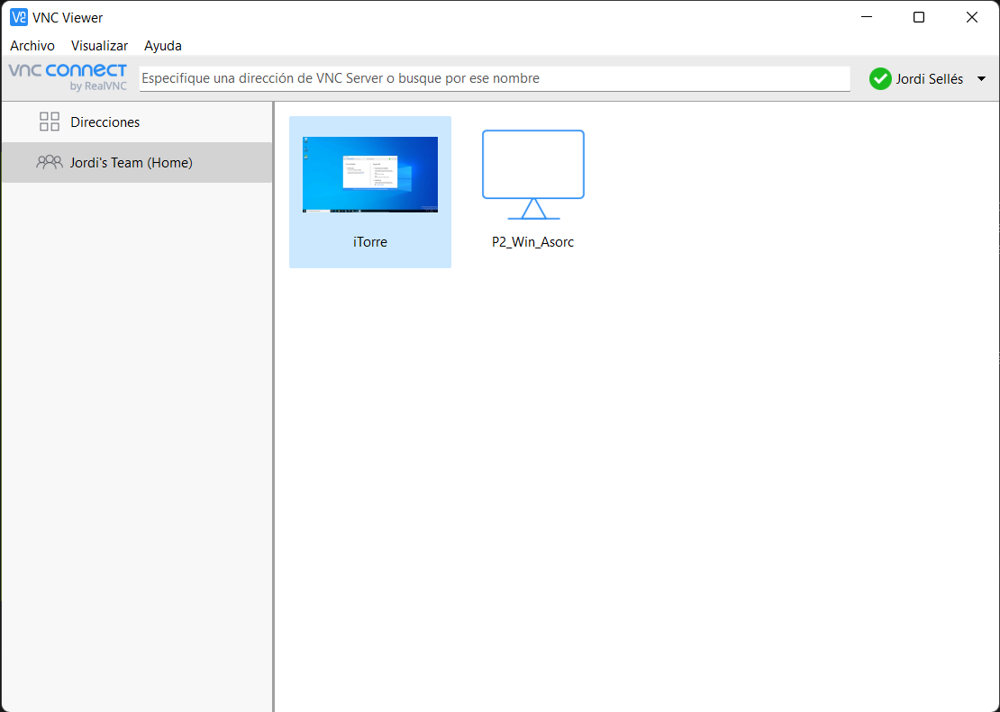

[](WindowsServer2022.md)

# Servicios remotos

Lo más normal es que usemos nuestro servidor de manera remota, por lo que usaremos algunos servicios remotos como ```SSH```, ```SFTP``` y ```SCP```.

Para instalar estos servicios tendremos que instalar ```SSH```, aunque ya nos lo encontramos instalado en nuestro sistema. Lo único que tenemos que hacer es habilitar la característica opcional del Servidor de OpenSSH. Esto lo tenemos en Configuración -> Aplicaciones y características -> Características opcionales.

Otra manera de instalarlo es usando Powershell. Vamos a verlo:

```powershell
# Instalación de OpenSSH Server
Add-WindowsCapability -Online -Name OpenSSH.Server*

# Comprobar que está instalado
Get-WindowsCapability -Online | ? Name -like 'OpenSSH.Ser*'
```

Finalmente, para comprobar que el servicio SSH funciona y por tal de repasar el funcionamiento de _SYSTEMD_ en Windows, podemos usar los siguientes comandos:

```powershell
# Comprobar el estado del servidor sshd
Get-Service sshd

# Iniciar el servidor sshd
Start-Service sshd

# Detener el servidor sshd
Stop-Service sshd
```

Es muy importante establecer como automático el arranque del servicio SSH para que se inicie con el sistema:

```powershell
# Establecer el arranque del servicio como automático
Set-Service sshd -StartupType Automatic
```

Para más detalles, es interesante revisar la [documentación de Microsoft](https://docs.microsoft.com/es-es/windows-server/administration/openssh/openssh_server_configuration).

Por último, escribimos el comando siguiente en el servidor para que las conexiones entrantes al servidor SSH se ejecuten en Powershell:

```powershell
New-ItemProperty -Path "HKLM:\SOFTWARE\OpenSSH" -Name DefaultShell -Value "C:\Windows\System32\WindowsPowerShell\v1.0\powershell.exe" -PropertyType String -Force
```

## Asegurando que el firewall permite conexiones entrantes a través del puerto 22

El servicio SSH funciona por defecto a través del puerto 22, por lo que es conveniente comprobar que el firewall lo permite o activarlo en su defecto. Para ello será tan simple como escribir el siguiente comando:

```powershell
# Comprobando si existe alguna regla para el firewall
Get-NetFirewallRule -Name *OpenSSH-Server* |select Name, DisplayName, Description, Enabled

# Creación de una nueva regla para el firewall
New-NetFirewallRule -Name sshd -DisplayName 'OpenSSH Server (sshd)' -Enabled True -Direction Inbound -Protocol TCP -Action Allow -LocalPort 22
```

## Configuración de SSH

Es necesario que por seguridad configuremos algunos aspectos de SSH para que se prohiban los accesos al usuario root y las contraseñas vacías. Para ello accederemos al archivo de configuración ```C:/ProgramData/ssh/sshd_config```. Como hemos instalado ```nano``` mediante Chocolatey, podemos editar el archivo con este programa. Descomentemos las líneas siguientes:

```powershell
# Abrir el archivo
nano C:/ProgramData/ssh/sshd_config
```

```powershell
PermitRootLogin no
PermitEmptyPasswords no
```

Ahora debemos reiniciar el servicio:

```powershell
Restart-Service sshd
```

## Activando el log de SSH

Para activar el log de SSH tendremos que acceder al ```C:/ProgramData/ssh/sshd_config``` y modificar las líneas siguietnes para qeu queden tal que así:

```powershell
#Logging
SyslogFacility DAEMON
LogLevel DEBUG
```

Ahora debemos de reiniciar el servicio:

```powershell 
Restart-Service sshd
```

## Generando una contraseña en un cliente para acceder al servidor

Para general clas claves públicas y privadas debemos hacer lo siguiente:

```powershell
## EJECUTAR POWERSHELL EN MODO DE ADMINISTRADOR

# Generar claves pública y privada en el directorio /home/root/.ssd
ssh-keygen -t rsa
```

### USANDO UN SERVIDOR LINUX/UNIX: Enviar al ordenador destino las claves para que se conecte sin pedirle la contraseña.

```bash
type id_rsa.pub | ssh REMOTE_USER@REMOTE_IP "cat >> /home/REMOTE_USER/.ssh/authorized_keys"
```

### USANDO UN SERVIDOR WINDOWS: Enviar al ordenador destino las claves para que se conecte sin pedirle la contraseña.

Para que un host windows nos permita el acceso sin contraseña, usaremos estos comandos:

```powershell
### ESTO SE ESCRIBE EN EL SERVIDOR

# Primero establecemos esta copia:
get-acl C:\ProgramData\ssh\ssh_host_dsa_key | set-acl C:\ProgramData\ssh\administrators_authorized_keys
```

```powershell
### ESTO SE ESCRIBE EN EL CLIENTE

# Leemos y guardamos la clave pública en una variable.
$public_key = Get-Content ~/.ssh/id_rsa.pub
# Añadimos la clave pública a administrators_authorized_keys en el servidor:
ssh administrador@192.168.137.223 "'$($public_key)' | Out-File C:\ProgramData\ssh\administrators_authorized_keys -Encoding UTF8 -Append"
```

## Funcionamiento de SFTP

Este servicio viene con SSH, por lo que no hay que instalar nada. Sólo tenemos que saber como usarlo.

Para conectarnos por Secure File Transfer Protocol usaremos el siguiente comando:

```powershell
sftp REMOTE_USER@REMOTE_IP
```

## Funcionamiento de SCP

Este servicio también viene con SSH, por lo tanto, no tendremos que instalar nada.

Para conectarnos por SCP usaremos el siguiente comando:

```powershell
scp <-P <puerto>> <ruta de archivo local> REMOTE_USER@REMOTE_IP:<ruta destino>
```

## VNC

El acceso al escritorio remoto se puede hacer mediante el cliente-servidor de Real VNC. Este sistema consta de dos partes, una aplicación cliente y una aplicación servidor. En nuestro servidor Windows instalaremos la aplicación de VNC Server, porque es la máquina a la que queremos acceder de manera remota. Y, en nuestro cliente, instalaremos la versión del cliente. Adjunto los enlaces:

- [VNC Server](https://www.realvnc.com/download/file/vnc.files/VNC-Server-6.8.0-Windows.exe)
- [VNC Viewer](https://www.realvnc.com/download/file/viewer.files/VNC-Viewer-6.21.920-Windows-64bit.exe)

Una vez instalado el servidor tendremos que iniciar sesión o crearnos una cuenta de RealVNC, donde podremos recoger en una especie de libreta de contactos a todos los equipos que vinculemos a nuestra cuenta. Por otra parte, en el cliente podremos ver esa libreta de contactos y conectarnos a cualquiera de nuestros equipos.

### VNC Server



### VNC Viewer



