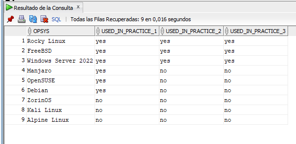
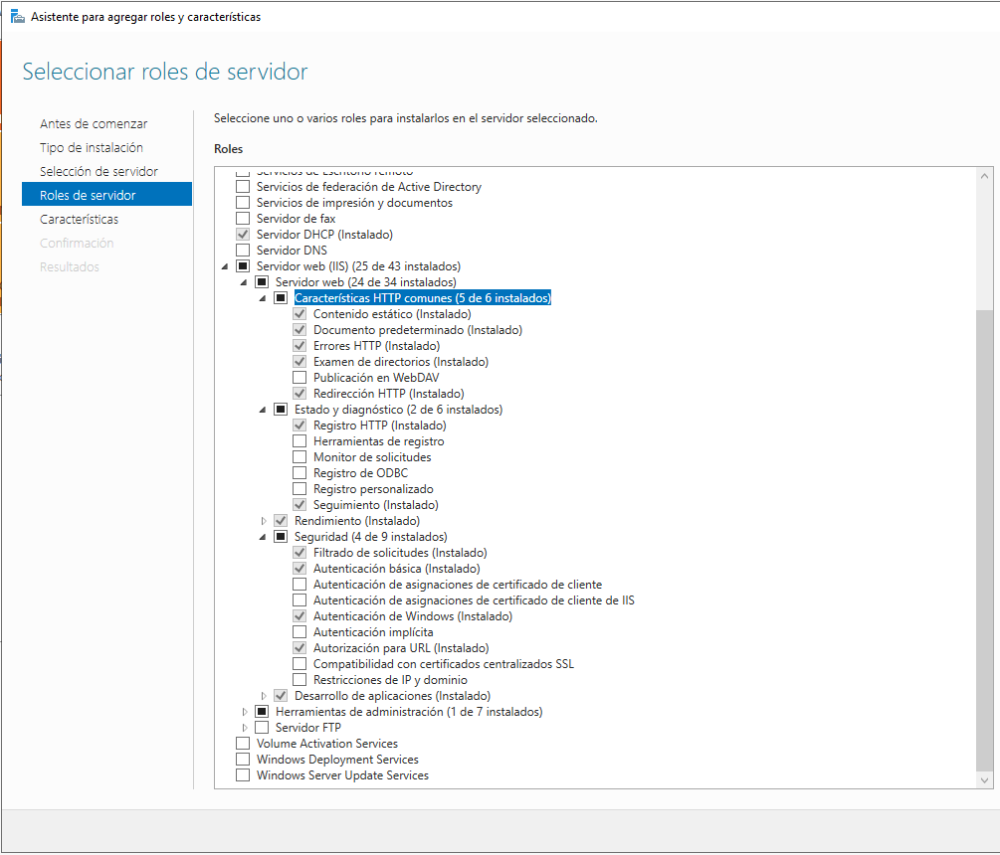
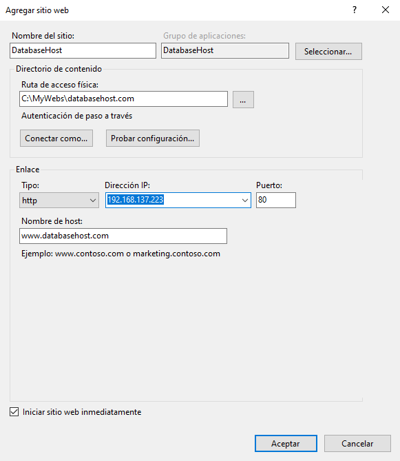
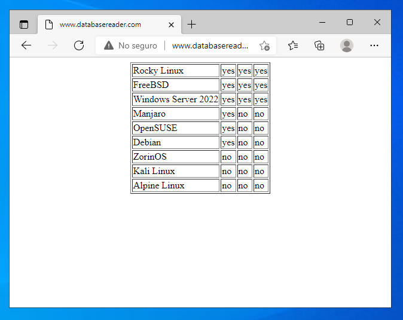

[](WindowsServer2022.md)  
![Internet Information Server](https://img.shields.io/badge/Internet%20Information%20Server-29B2FE?style=flat-square&logo=image/svg%2bxml;base64,PD94bWwgdmVyc2lvbj0iMS4wIiBlbmNvZGluZz0idXRmLTgiPz4KPCFET0NUWVBFIHN2ZyBQVUJMSUMgIi0vL1czQy8vRFREIFNWRyAxLjEvL0VOIiAiaHR0cDovL3d3dy53My5vcmcvR3JhcGhpY3MvU1ZHLzEuMS9EVEQvc3ZnMTEuZHRkIj4KPHN2ZyB2ZXJzaW9uPSIxLjEiIHhtbG5zPSJodHRwOi8vd3d3LnczLm9yZy8yMDAwL3N2ZyIgeG1sbnM6eGxpbms9Imh0dHA6Ly93d3cudzMub3JnLzE5OTkveGxpbmsiIHg9IjBweCIgeT0iMHB4IiB2aWV3Qm94PSIwIDAgMTAwMCAxMDAwIiBlbmFibGUtYmFja2dyb3VuZD0ibmV3IDAgMCAxMDAwIDEwMDAiIHhtbDpzcGFjZT0icHJlc2VydmUiPgo8bWV0YWRhdGE+IFN2ZyBWZWN0b3IgSWNvbnMgOiBodHRwOi8vd3d3Lm9ubGluZXdlYmZvbnRzLmNvbS9pY29uIDwvbWV0YWRhdGE+CjxnPjxwYXRoIGQ9Ik02MDUuOSw3NDQuNVY2MTQuOGMyNS40LDE1LjksNTAuNywyNy44LDc2LDM1LjVjMjUuMyw3LjgsNDkuMiwxMS42LDcxLjYsMTEuNmMyNy40LDAsNDktMy45LDY0LjctMTEuNmMxNS44LTcuOCwyMy43LTE5LjYsMjMuNy0zNS41YzAtMTAuMS0zLjYtMTguNi0xMC43LTI1LjNjLTcuMi02LjgtMTYuNC0xMi43LTI3LjYtMTcuOGMtMTEuMy01LjEtMjMuNi05LjYtMzYuOS0xMy43cy0yNi4zLTguNi0zOC42LTEzLjdjLTE5LjktNy44LTM3LjQtMTYuMS01Mi42LTI1LjFjLTE1LjEtOS0yNy44LTE5LjMtMzguMS0zMS4yYy0xMC4zLTExLjgtMTguMS0yNS41LTIzLjUtNDEuMWMtNS40LTE1LjUtOC4xLTM0LTguMS01NS4zYzAtMjkuMSw2LjEtNTQuMSwxOC40LTc1YzEyLjItMjAuOSwyOC41LTM4LjEsNDguOS01MS41YzIwLjMtMTMuNCw0My43LTIzLjIsNjkuOS0yOS40YzI2LjMtNi4zLDUzLjUtOS40LDgxLjktOS40YzIyLjIsMCw0NC42LDEuOCw2Ny40LDUuM2MyMi44LDMuNiw0NS4zLDguNyw2Ny40LDE1LjVWMzcxYy0xOS41LTExLjgtNDAuNS0yMC43LTYyLjgtMjYuNmMtMjIuMy01LjktNDQuMi04LjktNjUuNy04LjljLTEwLjEsMC0xOS42LDAuOS0yOC42LDIuOGMtOSwxLjgtMTYuOCw0LjUtMjMuNyw4LjFjLTYuOCwzLjYtMTIuMiw4LjEtMTYuMSwxMy43Yy0zLjksNS42LTUuOSwxMS45LTUuOSwxOWMwLDkuNSwzLDE3LjYsOC44LDI0LjNjNS45LDYuOCwxMy41LDEyLjYsMjMsMTcuNWM5LjUsNC45LDE5LjksOS4zLDMxLjUsMTMuMmMxMS42LDMuOSwyMyw3LjgsMzQuNSwxMS45YzIwLjUsNy40LDM5LjEsMTUuNSw1NS43LDI0LjNjMTYuNiw4LjgsMzAuOSwxOS4xLDQyLjgsMzAuOWMxMS45LDExLjgsMjEsMjUuNywyNy40LDQxLjZjNi40LDE1LjksOS41LDM0LjgsOS41LDU2LjhjMCwzMC43LTYuNCw1Ny0xOS4zLDc4LjhjLTEyLjksMjEuOC0zMCwzOS41LTUxLjMsNTMuMmMtMjEuMywxMy43LTQ1LjksMjMuNy03My44LDI5LjljLTI3LjgsNi4zLTU2LjgsOS40LTg2LjgsOS40QzcwMy44LDc3MC45LDY1Mi44LDc2Mi4xLDYwNS45LDc0NC41eiIvPjxwYXRoIGQ9Ik0xMCwyNDcuN2gyNDUuMXYxMDUuMUgxMFYyNDcuN3oiLz48cGF0aCBkPSJNMTAsNjY4LjNoMjQ1LjF2MTA1LjFIMTBWNjY4LjNMMTAsNjY4LjN6Ii8+PHBhdGggZD0iTTc5LjcsMzQ2aDEwNS43djMzNy41SDc5LjdWMzQ2TDc5LjcsMzQ2eiIvPjxwYXRoIGQ9Ik0yOTAuNCwyNDcuN2gyNDUuMXYxMDUuMUgyOTAuNFYyNDcuN3oiLz48cGF0aCBkPSJNMjkwLjQsNjY4LjNoMjQ1LjF2MTA1LjFIMjkwLjRWNjY4LjNMMjkwLjQsNjY4LjN6Ii8+PHBhdGggZD0iTTM2MC4xLDM0NmgxMDUuN3YzMzcuNUgzNjAuMVYzNDZMMzYwLjEsMzQ2eiIvPjwvZz4KPC9zdmc+&logoColor=white)


# Servicios de Web y Base de datos

## Servidor Oracle DB Express

Igual que se creó PostgreSQL, tenemos Oracle Express, otro sistema para bases de datos relacionales. Oracle creó su propio lenguaje llamado _PL/SQL_.

### Instalando el servidor:

Para instalar Oracle DB Express nos lo tendremos que descargar de la prágina oficial, puesto que no está en Chocolatey. Para descargarlo usaremos el siguiente comando:

```powershell
# Lo descargamos 
wget https://download.oracle.com/otn-pub/otn_software/db-express/OracleXE213_Win64.zip -O ~/Downloads/OracleDBE.zip

# Lo descomprimimos
unzip OracleDBE.zip
```

Tras descomprimirlo se nos creará una carpeta donde tendremos el instalador de Oracle. Lo ejecutamos e instalamos el programa.

https://docs.oracle.com/cd/E17781_01/admin.112/e18585/toc.htm#XEGSG110

### Activando los logs en Oracle Express

Para activar los logs en Oracle Express tendremos que abrir el programa ```sqlplus``` y entrar como usuario ```sys```, cosa que no se nos permitirá hacer directamente. Para ello tendremos que decirle a Oracle que entre al usuario ```sys as sysdba```, y no pondrá ninguna pega.

Una vez dentro de Oracle tendremos que reiniciar la base de datos y activar los logs siguiendo estos comandos:

```sql
-- Desmontamos la base de datos:
SHUTDOWN IMMEDIATE;

-- Montamos la base de datos:
STARTUP MOUNT;

-- Verificamos el estado de los logs:
ARCHIVE LOG LIST;
    /*
        Si aquí nos dice que el MODO ARCHIVADO no está activo,
        significa que los logs no están activados.
    */

-- Activamos el modo archivado:
ALTER DATABASE archivelog;

-- Abrimos la base de datos:
ALTER DATABASE OPEN;

-- Volvemos a verificar el estado de los logs:
ARCHIVE LOG LIST;

-- Marcamos los logs al inicio:
ALTER SYSTEM ARCHIVE LOG START;
```

### Creando un usuario phpuser

Ahora vamos a verificar que la base de datos funciona sin problemas, por lo que vamos a crear un usuario llamado _phpuser_ y una base de datos de pruebas.

Para acceder a Oracle usaremos el programa ```sqlplus``` desde powershell.

```sql
-- Alteramos la sesión:
ALTER SESSION SET "_ORACLE_SCRIPT"=true;

-- Creamos el usuario phpuser:
CREATE USER phpuser IDENTIFIED BY phpuser;

-- Otorgamos los permisos necesarios:
GRANT CREATE SESSION TO phpuser;
GRANT ALL PRIVILEGES TO phpuser;
```

Ahora tendríamos que abrir una sesión con la cuenta que hemos creado y crear una tabla nueva:

```sql
CREATE TABLE wintable (
    opsys varchar2(100) constraint pk_wintable primary key,
    used_in_practice_1 varchar2(20),
    used_in_practice_2 varchar2(20),
    used_in_practice_3 varchar2(20)
);

INSERT INTO wintable values ('Rocky Linux', 'yes', 'yes', 'yes');
INSERT INTO wintable values ('FreeBSD', 'yes', 'yes', 'yes');
INSERT INTO wintable values ('Windows Server 2022', 'yes', 'yes', 'yes');
INSERT INTO wintable values ('Manjaro', 'yes', 'no', 'no');
INSERT INTO wintable values ('OpenSUSE', 'yes', 'no', 'no');
INSERT INTO wintable values ('Debian', 'yes', 'no', 'no');
INSERT INTO wintable values ('ZorinOS', 'no', 'no', 'no');
INSERT INTO wintable values ('Kali Linux', 'no', 'no', 'no');
INSERT INTO wintable values ('Alpine Linux', 'no', 'no', 'no');
```

Leamos la tabla:

```sql
SELECT * FROM wintable;
```



### Instalando el Servidor IIS

_Internet Information Server_ (IIS) es un servidor web que provee un conjunto de servicios para sistemas operativos Windows. IIS ofrece soporte para los protocolos HTTP, HTTPS, FTP, FTPS, SMTP y NNTP. Resumidamente, es un Apache o NGinx versión Microsoft.

Para activar el servidor IIS tendremos que acceder al panel de administración del servidor, entrar en la opción de agregar roles y características y activar el servidor IIS. Además, es recomendable activar estas opciones:



Finalmente, podemos probar la instalación accediendo a _localhost_ desde el navegador del servidor y desde un cliente.

### Configurando un VirtualHost

La configuración no tiene pérdida. Se lleva a cabo desde el _Administrador de Internet Information Services_. Sólo tendremos que hacer click derecho sobre la capeta _sitios_ (situada en la parte izquierda) y seleccionar la opción de _Agregar sitio web_. Tras esto lo único que tendremos que hacer es seguir los pasos.



Previamente tendremos que tener creadas las carpetas de los dominios virtuales en la ruta ```C:/inetpub/wwwroot/```.

Ahora tendremos que modificar el archivo ```C:/Windows/System32/drivers/etc/hosts``` y le añadiremos lo siguiente:

```bash
127.0.0.1   www.MIWEB.com
```

### Instalación de PHP

Las últimas versiones de PHP que se podían instalar con un instalador _.msi_ se quedaron la versión 5. Actualmente está la versión 8, que es la que vamos a instalar. La instalación de PHP se hace descargando un archivo _.zip_ y descomprimiéndolo en el disco duro, configurando el _PATH_ del sistema y bla bla bla. 

Olvídate:

```powershell
choco install -y php
```

PHP instalado y preparado. Ahora toca revisar la configuración de PHP. Tendremos que acceder al archivo _PHP.ini_, ubicado en la ruta ```C:/tools/php80```.

- Descomentar el directorio de extensiones:

    ```powershell
      fastcgi.impersonate = 1
      cgi.fix_pathinfo = 0
      cgi.force_redirect = 0
      open_basedir = "C:\inetpuc\wwwroot"
      error_log = php_errors.log
      extension_dir = "ext"
    ```

- Asegurarnos de habilitar las extensiones siguientes:

    ```powershell
      extension=curl
      extension=fileinfo
      extension=gd
      extension=intl
      extendion=mbstring
      extension=oci8_19
      extension=odbc
      extension=openssl
      extension=pdo_mysql
      extension=pdo_oci
      extension=pdo_odbc
    ```

¿Cómo podemos establecer que IIS abra por defecto un archivo _.php_? Muy sencillo: en la configuración del sitio accedemos a la opción de _documento predeterminado_ y añadimos _index.php_.

Ahora bien, para leer con PHP la base de datos que hemos creado, usamos el siguiente script:

```php
<!DOCTYPE HTML>
<html>

<body>
  <center>
    <?php
    $db_user = "phpuser";
    $db_pass = "phpuser";
    $conexión = oci_connect($db_user, $db_pass, 'localhost/XE');
    if (!$conexión) {
      $e = oci_error();
      trigger_error(htmlentities($e['message'], ENT_QUOTES), E_USER_ERROR);
    }

    // Preparar la sentencia
    $stid = oci_parse($conexión, 'SELECT * FROM wintable');
    if (!$stid) {
      $e = oci_error($conexión);
      trigger_error(htmlentities($e['message'], ENT_QUOTES), E_USER_ERROR);
    }

    // Realizar la lógica de la consulta
    $r = oci_execute($stid);
    if (!$r) {
      $e = oci_error($stid);
      trigger_error(htmlentities($e['message'], ENT_QUOTES), E_USER_ERROR);
    }

    // Obtener los resultados de la consulta
    print "<table border='1'>\n";
    while ($fila = oci_fetch_array($stid, OCI_ASSOC + OCI_RETURN_NULLS)) {
      print "<tr>\n";
      foreach ($fila as $elemento) {
        print "    <td>" . ($elemento !== null ? htmlentities($elemento, ENT_QUOTES) : "") . "</td>\n";
      }
      print "</tr>\n";
    }
    print "</table>\n";

    oci_free_statement($stid);
    oci_close($conexión);

    ?>
  </center>
</body>

</html>
```

Finalmente, el resultado es el siguiente:



### Instalando y configurando MariaDB

Vamos a instalar y configurar MariaDB porque necesitamos este servidor de bases de datos para poder trabajar con CMS como WordPress o Joomla. Para llevar a cabo su instalación será tan simple como instalarlo con Chocolatey:

```powershell
choco install -y mariadb
```

Ahora procedemos a configurar MariaDB. Para ello habrá que entrar con ```mysql -u root``` y hacer los siguientes pasos:

```sql
-- Estableciendo una contraseña para el usuario root:
ALTER USER 'root'@'localhost' IDENTIFIED BY 'PASSWORD';
```

Una vez que hemnos cambiado la constraseña es interesante verificar que funciona. Tras esto, continuamos:

```sql
-- HABILITAMOS LOS LOGS
-- Indicamos que la salida de los logs será en un archivo:
SET GLOBAL log_output = 'FILE';

-- Especificamos la ruta del archivo donde se guardarán los logs:
SET GLOBAL general_log_file='C:\logs\mariadb\mariadb.log';

-- Habilitamos los logs
SET GLOBAL general_log = 'ON';
```

Tras esto, ya tenemos MariaDB configurado y ahora podemos instalar los CMS.

### Instalando y configurando WordPress

La instalación de WordPress es relativamente sencilla. Primero descargaremos WordPress desde [aquí](https://wordpress.org/latest.zip) o con WGET:

```powershell
wget https://wordpress.org/latest.zip
```

Tras esto lo descomprimeros en el directorio del virtualhost que hayamos creado para WordPress. Esto se descomprimirá dentro de una carpeta llamada _wordpress_ y yo lo he sacado de ahí porque resulta más sencillo de configurar todo. Finalmente, antes de instalar el CMS tenemos que crear un usuario y una base de datos en MariaDB para WordPress. Esto lo haremos así:

```sql
CREATE DATABASE wordpress_db;
CREATE USER 'wordpress_user'@'localhost' IDENTIFIED BY 'wordpress_user';
GRANT ALL ON wordpress_db.* TO 'wordpress_user'@'localhost';
FLUSH PRIVILEGES;
EXIT;
```

OJO: igual que anteriormente hemos configurado IIS para que abra la web en un archivo _index.php_, ahora también tendremos que hacerlo.


