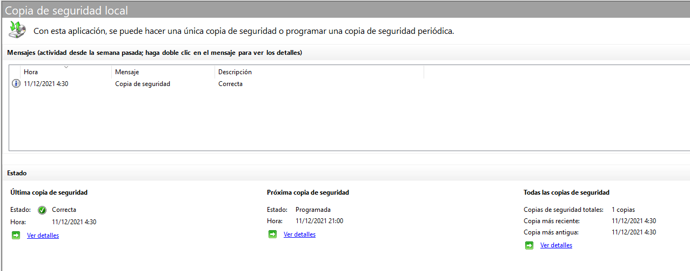

# _Backup_

Para preparar el sistema de copias de seguridad entraremos en la opción de _agregar roles y características_ del panel de control de nuestro servidor Windows. Añadiremos la característica de _Copias de Seguridad de Windows Server_.

Una vez instalado, usaremos el buscador de aplicaciones para encontrar esta característica. Como lo que queremos es demostrar el funcionamiento de las copias de seguridad de Windows Server, vamos a hacer una copia de seguridad de una carpeta concreta. Para ello haremos una copia de seguridad personalizada. A continuación, nos pregunta dónde queremos guardar la copia de seguridad. Hacerlo en el mismo disco carece de utilidad práctica, por lo que lo guardaremos en el sistema RAID. 

Se puede configurar de modo que haga las copias de seguridad a determinadas horas del día.

A continuación, podemos ver el resultado que nos brinda la aplicación sobre las copias de seguridad que se han hecho en el sistema:

