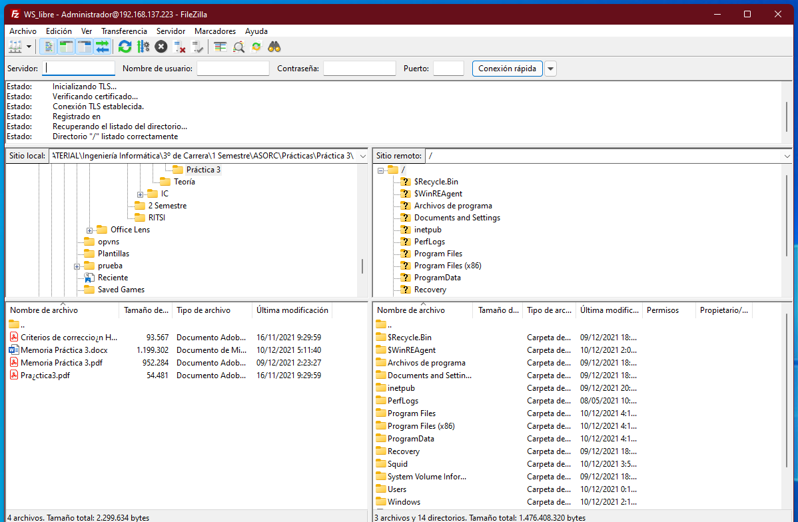
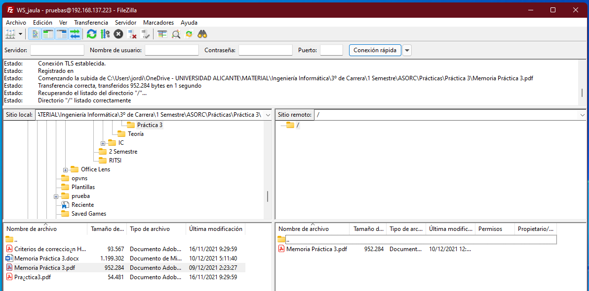

# Servidor FTP

Para montar un servidor FTP en nuestro Windows Server usaremos FileZilla Server. Esto es relativamente sencillo de instalar, tan sólo tendremos que descargar el ejecutable desde [aquí](https://filezilla-project.org/download.php?type=server) y seguir los pasos del instalador.

Una vez instalado el servidor, crearemos los usuarios. Un usuario será _Administrador_, y le especificaremos como directorio virtual todo el disco duro. El otro usuario será el usuario enjaulado, que tendrá acceso sólo a la ruta especificada para él mismo.

Es recomendable desactivar el firewall (no es lo mejor que se puede hacer) o, mejor aún, crear una regla que permita la entrada y salida de información a través del puerto 21, que es el que usa FTP por defecto.

Tras esto, podremos usar nuestro cliente de FTP para conectarnos al servidor y no tendremos ningún problema.

Aquí podemos ver el caso del usuario que tiene acceso a todo el disco:

Aquí podemos ver el caso del usuario que hemos enjaulado:

