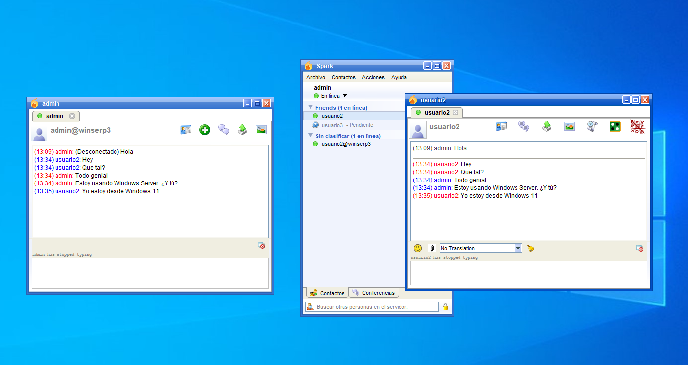

# Mensajería instantánea (_Openfire_)

Para instalar un servidor de mensajería instantánea podemos usar OpenFire.

La instalación de OpenFire se podrá llevar a cabo descargando el instalador desde la página oficial. Yo he descargado el instalador que incorpora el JRE. Este instalador lo podemos descargar desde [aquí](https://www.igniterealtime.org/downloadServlet?filename=openfire/openfire_4_6_5_bundledJRE_x64.exe).

Al finalizar la instalación se nos abre la web de configuración de OpenFire. Es importante destacar que OpenFire nos brinda la posibilidad de que sea él mismo quien cree la base de datos. Aprovecharemos esta herramienta para que sea más sencillo de instalar y de utilizar.

Tras esto, ya podemos crear usuarios en nuestro servidor de mensajería instantánea.

# Instalación del cliente (_Spark_)

Podemos encontrar _Spark_ en la misma web desde donde nos hemos descargado OpenFire. Aunque si hacemos click [aquí](https://www.igniterealtime.org/downloadServlet?filename=spark/spark_2_9_4-with-jre.exe) también lo podemos descargar.

La instalación no tiene nada característico a destacar. Siguiente, siguiente. Una vez instalado, en la conexión de Spark tendremos que ir a la sección de _Avanzado_ y decirle que no use certificados. Luego podremos iniciar sesión sin ningún problema.

A continuación, podremos observar cómo chatean dos usuarios. El de la derecha está desde el servidor de Windows y el de la izquierda, desde Windows 11.

