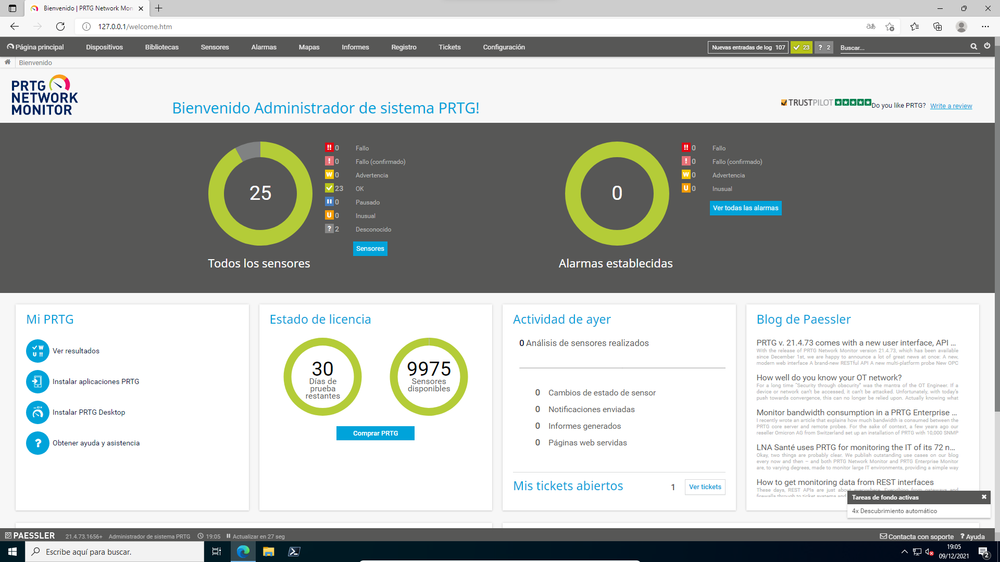

# Monitor de servicios (_PRTG_)

Para tener un monitor de servicios en Windows usaremos PRTG. La instalación es relativamente sencilla. Sólo tendremos que seguir los pasos del instalador que podemos encontrar [aquí](https://www.paessler.com/prtg/download).

