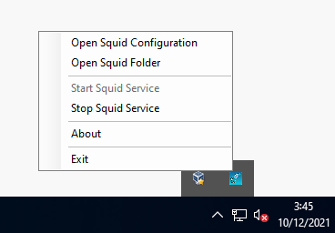

# Proxy (_Squid_)

Para instalar un Proxy en nuestro servidor Windows usaremos _Squid_, tal y como lo hemos hecho en los otros sistemas. Podemos descargar _Squid_ desde [aquí](https://packages.diladele.com/squid/4.14/squid.msi)

Para acceder a la configuración de _Squid_ lo haremos desde la opción de la captura siguiente. Se nos abrirá un archivo exactamente igual al que tenemos en _FreeBSD_ o _Rocky Linux_, por lo que nos podremos basar en su configuración. 



Tras abrir el archivo, añadiremos las siguientes reglas:

```bash
#
# INSERT YOUR OWN RULE(S) HERE TO ALLOW ACCESS FROM YOUR CLIENTS
#
acl blocksitelist dstdomain "C:\Squid\blockwebsites.lst"
http_access deny blocksitelist

acl blockkeywordlist url_regex "C:\Squid\blockkeywords.lst"
http_access deny blockkeywordlist
```

:warning: Ojo: Puede darse el caso de que el proxy no funcione. Esto se debería a que los archivos especificados se han creado desde la interfaz gráfica, y eso quiere decir que son ```*.lst.txt```. Por lo tanto, tocaría revisarlo y quitar el ```.txt```.

```bash
# Example rule allowing access from your local networks.
# Adapt localnet in the ACL section to list your (internal) IP networks
# from where browsing should be allowed
http_access allow localnet
#http_access allow localhost

# And finally deny all other access to this proxy
#http_access deny all
http_access allow all
```

Ahora tendremos que cambiar la máscara de red de la IP con la que nos conectamos a Internet (10.0.0.0). Tiene que quedar tal que así (principio del archivo):

```bash
acl localnet src 10.0.0.0/24        # RFC 1918 local private network (LAN)
```


